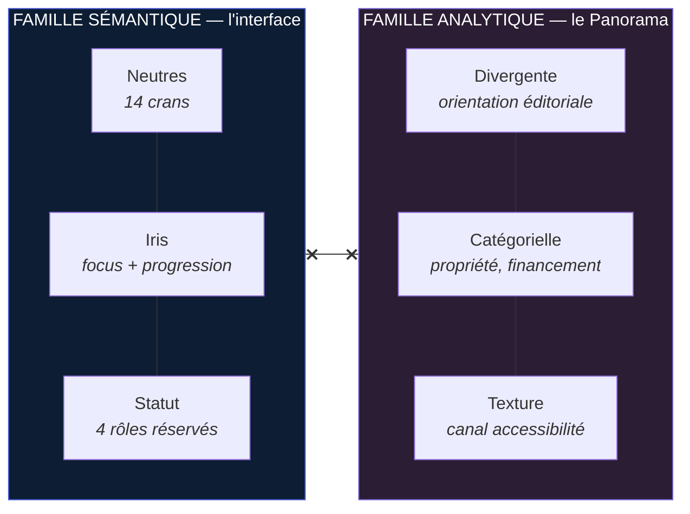
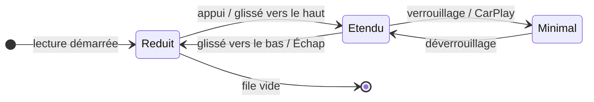

# Système de design — v1

**Prisme — boucle 3**

> **Périmètre** : couleurs, typographie, espacement, composants, cartes, listes, lecteur audio, widgets.
> **Prérequis** : [Socle stratégique](../produit/strategie-v1.md) · [Architecture](../produit/architecture-v1.md).
> **Hors périmètre, explicitement** : aucune page complète, aucun écran assemblé, aucune maquette de produit. Les composants sont spécifiés **isolés**. La composition est la boucle 4.
> **Jetons exécutables** : [`tokens.css`](tokens.css).
> **Équipe** : Design System Architect · UI Designer · Apple Human Interface Expert.

---

## 0. La thèse du système

### 0.1 Les trois inspirations ne s'accordent pas — et c'est exploitable

| Inspiration | Ce qu'elle apporte réellement | Ce qu'elle impose |
|---|---|---|
| **Apple Podcasts** | L'artisanat du **temps** : file d'attente, reprise exacte, lecteur réduit ↔ étendu, minutage, teinte issue de la vignette. La meilleure référence du marché sur la consommation différée. | Conventions HIG : Dynamic Type, cibles ≥ 44 pt, Reduce Motion, listes groupées, grands titres. |
| **Pinterest** | La **générosité éditoriale** : respiration, rayons généreux, carte souveraine, image qui porte le contenu, hiérarchie typographique franche. | Une densité basse et un rapport image/texte élevé — coûteux en surface. |
| **Linear** | La **précision de l'inventaire** : densité assumée, nuances de gris travaillées, filets plutôt qu'ombres, clavier de premier rang, retenue chromatique totale. | Une densité haute et une palette quasi monochrome. |

*Note d'honnêteté : la page Pinterest Business que vous citez est bloquée par le proxy réseau de cette session. Ce qui suit s'appuie sur le langage visuel Pinterest tel que je le connais — carte à rayon généreux, image dominante, typographie éditoriale à fort contraste de graisse, blancs larges. À revalider par l'équipe sur la source.*

**Pinterest et Linear s'opposent frontalement sur la densité.** Les fusionner en moyenne produirait un produit tiède — ni généreux ni précis.

### 0.2 La résolution : une seule échelle, deux densités

Le produit a **deux modes d'attention**, identifiés dès la boucle 1, et ils ne demandent pas la même densité :

| Mode | Où | Persona | Densité | Inspiration dominante |
|---|---|---|---|---|
| **Traversée** — je consomme, une chose à la fois | `Aujourd'hui`, détail d'un Sujet, lecture, lecteur | P2 (Marc), P5 (Amira) | `ample` | Pinterest |
| **Inventaire** — je pilote, je balaie, je trie | `Sujets`, `Sources`, `Bibliothèque`, règles | P1 (Nadia), P4 (Tomás) | `dense` | Linear |

> **Ce n'est pas deux systèmes de design. C'est un système avec un axe de densité.**
> Mêmes jetons primitifs, mêmes composants, mêmes couleurs. Seuls les **alias sémantiques d'espacement** et deux crans de l'échelle typographique changent. Un composant qui aurait besoin d'être *redessiné* selon la densité est un composant mal conçu.

Apple Podcasts ne se situe pas sur cet axe : il gouverne la **couche temporelle** (lecteur, file, minutage), orthogonale à la densité et identique dans les deux modes.

### 0.3 Les quatre règles fondatrices

| # | Règle | Origine | Ce qu'elle interdit |
|---|---|---|---|
| **S1** | **La couleur n'est jamais décorative — elle porte une information.** Budget : **un seul accent coloré par vue**. | Principe 9 · A7 | Les aplats de marque, les icônes colorées par catégorie, les dégradés d'ambiance. |
| **S2** | **L'action primaire est de l'encre, pas une teinte.** Le bouton principal est noir sur clair, blanc sur sombre. | Principe 9 · Linear | Le bouton bleu par défaut. La teinte est réservée au focus et à la progression de session. |
| **S3** | **L'incertitude est une texture, jamais une couleur.** Un rapprochement non confirmé se signale par une hachure, pas par un jaune d'alerte. | **A4** | De confondre *« je ne suis pas sûr »* avec *« attention, problème »*. |
| **S4** | **Aucun nombre qui monte.** Le seul compteur de l'interface décroît vers zéro. | **A7** · Principe 2 | Les pastilles de non-lus, les badges d'application, les compteurs de collection. |

---

## 1. Couleurs

### 1.1 Deux familles strictement séparées

**La règle de séparation, non négociable :** une couleur analytique n'apparaît jamais dans l'interface, une couleur sémantique n'apparaît jamais dans un graphique. Sans cette barrière, le rouge « critique » de l'interface finirait par colorer une orientation éditoriale — et le produit trancherait le vrai, en violation du Principe 4.

### 1.2 Neutres — le matériau principal

Gris **légèrement chauds** (teinte OKLCH ≈ 90°, chroma ≤ 0,012) : la neutralité froide de Linear rendrait un produit de lecture clinique ; la chaleur de Pinterest, sans sa saturation, l'habite.

| Cran | Clair | Sombre | Emploi |
|---|---|---|---|
| `n-0` | `#FFFFFF` | `#0E0E0D` | Fond de carte (clair) / plan (sombre) |
| `n-25` | `#FAF9F6` | `#141413` | Survol de surface |
| `n-50` | `#F7F6F3` | `#1A1A18` | Plan (clair) / carte (sombre) |
| `n-100` | `#EFEDE8` | `#222220` | Surface enfoncée, champ au repos |
| `n-150` | `#E3E1DB` | `#2C2B28` | **Filet séparateur** |
| `n-200` | `#D5D2CA` | `#38372F` | Bordure douce, piste de jauge |
| `n-300` | `#B8B4AA` | `#4A4945` | Élément désactivé |
| `n-400` | `#96928A` | `#5C5953` | Encre faible |
| `n-450` | `#8A867E` | `#6E6A63` | **Bordure de contrôle** — 3,63:1 clair · 3,24:1 sombre |
| `n-500` | `#78746D` | `#78746D` | Encre tertiaire |
| `n-600` | `#5C5953` | `#96928A` | Encre secondaire |
| `n-700` | `#44423D` | `#B8B4AA` | — |
| `n-800` | `#2C2B28` | `#D5D2CA` | — |
| `n-900` | `#1A1A18` | `#F5F4F0` | **Encre primaire** |

**Contrastes mesurés** (WCAG 2.1, sur carte) :

| Rôle | Clair | Sombre | Exigence | Verdict |
|---|---|---|---|---|
| Encre primaire | 17,43:1 | 15,84:1 | 4,5:1 | ✅ |
| Encre secondaire | 6,98:1 | 8,42:1 | 4,5:1 | ✅ |
| Encre tertiaire | 4,65:1 | 5,62:1 | 4,5:1 | ✅ |
| Encre faible | 3,10:1 | — | 3:1 (texte large uniquement) | ✅ |
| Bordure de contrôle | 3,63:1 | 3,24:1 | 3:1 (WCAG 1.4.11) | ✅ |
| Filet séparateur | 1,31:1 | 1,23:1 | aucune | ✅ décoratif — **jamais porteur de sens** |

*Le filet séparateur est sous 3:1 délibérément : il ne délimite aucun composant identifiable, il aère. Une frontière qui **doit** être perçue utilise `n-450`.*

### 1.3 Iris — la teinte unique

Un seul accent coloré dans tout le produit, et **trois emplois autorisés** :

1. l'anneau de focus (clavier),
2. l'arc de progression de session,
3. l'état actif de la bascule de modalité.

| | Clair | Sombre | Contraste sur carte |
|---|---|---|---|
| Iris | `#4A5BD4` | `#8A97F0` | 5,62:1 · 6,45:1 |
| Encre sur pastille iris | `#FFFFFF` | `#111114` | 5,62:1 · 6,97:1 |

**Pourquoi si peu.** Le Principe 9 (*le défaut doit être calme*) et la règle S1 rendent tout accent supplémentaire coûteux. Un produit qui traite quotidiennement des sujets lourds ne doit pas ajouter du bruit chromatique à une charge émotionnelle déjà élevée (job E2).

**Pourquoi cette teinte.** Elle est écartée d'au moins ΔE 15 des deux pôles du Panorama, donc elle ne peut jamais être lue comme une orientation éditoriale.

### 1.4 Statut — quatre rôles réservés

Toujours accompagnés d'une **icône et d'un libellé** : jamais la couleur seule.

| Rôle | Clair | Sombre | Emploi dans Prisme |
|---|---|---|---|
| `bon` | `#0CA30C` | `#0CA30C` | Ingestion saine. Export réussi. |
| `avertissement` | `#FAB219` | `#FAB219` | Source dégradée. Quota proche. |
| `sérieux` | `#EC835A` | `#EC835A` | Source rompue depuis > 7 j. |
| `critique` | `#D03B3B` | `#D03B3B` | Citation irrésolvable → **synthèse non servable** (R8). |

**Il n'existe pas de couleur « bouclé ».** C'est une décision, pas un oubli — voir §4.5.

### 1.5 Panorama — palette analytique validée

Toutes les valeurs ci-dessous ont été **vérifiées par exécution** du validateur (six contrôles : bande de clarté, plancher de chroma, séparation daltonisme protan/deutan, plancher vision normale, contraste sur surface), et non choisies à l'œil.

#### a. Orientation éditoriale — échelle divergente

L'orientation est **une polarité** (deux directions opposées autour d'un centre) : méthodologiquement, une divergente à deux teintes et milieu gris neutre.

> **Le piège que cette palette évite.** Ground News code l'orientation en **rouge/bleu**. Ce codage est **inversé entre la France et les États-Unis** — en France le rouge est à gauche, aux États-Unis le bleu l'est. Utiliser cette paire, c'est importer une lecture nationale et trancher implicitement. **Prisme utilise violet ↔ ocre**, deux teintes sans charge politique établie dans nos marchés, et **documente le mapping comme arbitraire**.

| Segment | Clair | Sombre |
|---|---|---|
| Pôle froid ▓▓▓ | `#4A3AA7` | `#B3A9F2` |
| Froid ▓▓ | `#7A6BD8` | `#8A7DE0` |
| Froid ▓ | `#A99EE4` | `#6A5FC0` |
| **Centre — neutre** | `#CBC8BF` | `#54534E` |
| Chaud ▓ | `#D89C48` | `#8A5614` |
| Chaud ▓▓ | `#C07D22` | `#C0842C` |
| Pôle chaud ▓▓▓ | `#8F5410` | `#E5AF5E` |

**Validation exécutée :**

| Contrôle | Résultat |
|---|---|
| Bras froid, rampe ordinale (clair / sombre) | ✅ clarté monotone · écarts ΔL ≥ 0,06 · extrémité claire 2,41:1 · teinte unique (7°) |
| Bras chaud, rampe ordinale (clair / sombre) | ✅ clarté monotone · écarts ΔL ≥ 0,06 · extrémité claire 2,39:1 · teinte unique |
| Séparation des deux pôles, clair | ✅ ΔE 25,3 daltonisme · **26,8 vision normale** (plancher 15) |
| Séparation des deux pôles, sombre | ✅ ΔE 21,3 daltonisme · **21,2 vision normale** |

*Les pôles sortent de la bande de clarté « catégorielle » en mode sombre : attendu et sans conséquence — c'est une rampe divergente, dont les extrémités doivent précisément sortir de la bande. Les contrôles qui comptent ici (séparation, contraste) passent dans les deux modes.*

**Trois règles d'emploi opposables :**
1. **La légende n'est jamais optionnelle**, et elle énonce que le mapping teinte→orientation est conventionnel.
2. **Étiquetage direct obligatoire** sur chaque segment ≥ 8 % : l'identité ne repose jamais sur la couleur seule.
3. Un **mode neutre** (monochrome + texture, §1.6) est accessible en un geste. Il n'est pas une option d'accessibilité : c'est la réponse au persona P5, qui se méfie de toute source, y compris de nous.

#### b. Propriété et financement — palette catégorielle

Nominale (l'ordre ne porte pas de sens) : huit teintes, **ordre figé, jamais recyclé**.

| Cran | 1 | 2 | 3 | 4 | 5 | 6 | 7 | 8 |
|---|---|---|---|---|---|---|---|---|
| Clair | `#2A78D6` | `#EB6834` | `#1BAF7A` | `#EDA100` | `#E87BA4` | `#008300` | `#4A3AA7` | `#E34948` |
| Sombre | `#3987E5` | `#D95926` | `#199E70` | `#C98500` | `#D55181` | `#008300` | `#9085E9` | `#E66767` |

**Validation exécutée** (surfaces Prisme : `#FFFFFF` / `#1A1A18`) :

| Contrôle | Clair | Sombre |
|---|---|---|
| Bande de clarté | ✅ | ✅ |
| Plancher de chroma | ✅ | ✅ |
| Séparation daltonisme (adjacents) | ✅ ΔE 9,1 | ✅ ΔE 8,4 |
| Plancher vision normale | ✅ ΔE 19,6 | ✅ ΔE 19,3 |
| Contraste sur surface | ⚠️ 3 crans < 3:1 | ✅ |

> ⚠️ **L'avertissement de contraste en mode clair n'est pas ignorable.** Il **oblige** un canal de secours : étiquetage direct visible, ou vue tableau. Le Panorama impose donc les deux — ce qui était déjà exigé par le Pilier 3 (méthodologie contestable ⇒ données consultables).

**Plafond de séries : 3.** Au-delà, les paires ne tiennent plus le plancher toutes-paires. Les propriétaires au-delà du 3ᵉ sont regroupés en « Autres », détaillés dans la vue tableau. Ce n'est pas un pis-aller : c'est la contrainte du canal couleur, et elle est mesurée.

### 1.6 Texture — le canal d'accessibilité, et le canal de l'incertitude

Une seule trame de hachures, à **45° et son miroir à 135°**, encrée ton sur ton.

| Déclencheur | Emploi |
|---|---|
| Réglage d'accessibilité, impression, `forced-colors` | Double le codage couleur du Panorama. |
| **Mode neutre** du Panorama | Remplace la couleur : rotation ordonnée selon la position sur l'axe. |
| **Règle S3 — incertitude** | Un `RATTACHEMENT` de statut `candidat` porte une **bordure hachurée 45°** en `n-450`. |

**Pourquoi la texture pour l'incertitude (S3).** Un jaune d'alerte dirait *« attention, anomalie »*. Or A4 ne décrit pas une anomalie : le système fait exactement son travail en refusant de fusionner sous le seuil. La hachure dit *« lien non consolidé »* sans échelle de gravité — et elle survit au daltonisme, au mode sombre et à l'impression.

### 1.7 Teinte dynamique du lecteur

Comme Apple Podcasts, le lecteur étendu extrait une teinte de la vignette de l'éditeur. **Bridée**, pour ne pas contredire S1 :

| Contrainte | Valeur |
|---|---|
| Chroma OKLCH maximal | `0,08` — au-delà, on ramène sur la limite |
| Contraste minimal texte/fond du lecteur | 4,5:1, vérifié après extraction ; sinon repli sur `n-50` / `n-900` |
| Surface d'application | Fond du lecteur étendu **uniquement** — jamais les contrôles, jamais une carte |
| `Réduire la transparence` activé | Extraction désactivée, fond neutre plein |

---

## 2. Typographie

### 2.1 Trois familles, trois métiers

| Rôle | Pile | Pourquoi |
|---|---|---|
| **Interface** | `-apple-system, BlinkMacSystemFont, "SF Pro Text", "Inter", "Segoe UI", Roboto, sans-serif` | SF Pro sur les plateformes Apple — conformité HIG et Dynamic Type natif. Inter ailleurs. |
| **Lecture** | `ui-serif, Charter, "Bitstream Charter", "Source Serif 4", Georgia, serif` | **Une décision de fond** : le produit vend la compréhension de textes longs. Une empattement franc distingue *lire* de *piloter*, et soutient les sessions longues (P4, Tomás). |
| **Données** | `ui-monospace, "SF Mono", "JetBrains Mono", monospace` + `font-variant-numeric: tabular-nums` | Minutages, durées, pourcentages du Panorama. L'alignement vertical est fonctionnel, pas esthétique. |

**Règle :** la famille de lecture ne sert **que** au corps des synthèses `intégral` et des articles. Titres, contrôles et listes restent en interface. Une carte n'utilise jamais le serif — sinon la frontière *lire / piloter* se brouille.

### 2.2 Échelle

Tout en `rem`. **Jamais de `px`** : le Dynamic Type d'iOS et le zoom navigateur doivent traverser l'échelle entière (exigence HIG et WCAG 1.4.4).

| Rôle | Correspondance HIG | Taille | Graisse | Interligne | Interlettrage | Famille |
|---|---|---|---|---|---|---|
| Titre d'écran | Large Title | `2.125rem` / 34 | 700 | 1,15 | −0,022em | interface |
| Titre 1 | Title 1 | `1.75rem` / 28 | 650 | 1,20 | −0,018em | interface |
| Titre 2 | Title 2 | `1.375rem` / 22 | 620 | 1,25 | −0,014em | interface |
| Titre 3 | Title 3 | `1.1875rem` / 19 | 600 | 1,30 | −0,010em | interface |
| Accroche | Headline | `1rem` / 16 | 600 | 1,35 | −0,006em | interface |
| Corps interface | Body | `1rem` / 16 | 400 | 1,45 | 0 | interface |
| **Corps de lecture** | — | `1.1875rem` / 19 | 400 | **1,65** | 0 | **lecture** |
| Complément | Callout | `0.9375rem` / 15 | 400 | 1,40 | 0 | interface |
| Sous-titre | Subheadline | `0.875rem` / 14 | 500 | 1,40 | 0 | interface |
| Note | Footnote | `0.8125rem` / 13 | 400 | 1,38 | +0,002em | interface |
| Légende 1 | Caption 1 | `0.75rem` / 12 | 500 | 1,33 | +0,006em | interface |
| Légende 2 | Caption 2 | `0.6875rem` / 11 | 500 | 1,30 | +0,010em | interface |
| Donnée | — | `0.8125rem` / 13 | 500 | 1,00 | 0 | données |

**Les deux seuls crans qui bougent avec la densité :**

| Rôle | `ample` | `dense` |
|---|---|---|
| Corps de lecture | `1.1875rem` | `1.0625rem` (interligne 1,60) |
| Corps interface | `1rem` | `0.9375rem` |

Tout le reste est identique. **Une échelle, deux densités** (§0.2).

### 2.3 Règles de composition

| Règle | Valeur | Justification |
|---|---|---|
| Longueur de ligne en lecture | **62–72 signes** (`max-width: 68ch`) | Au-delà, le retour à la ligne coûte ; en deçà, le rythme se hache. |
| Longueur de ligne en interface | ≤ 90 signes | |
| Troncature des titres de Sujet | 2 lignes `ample`, 1 ligne `dense`, coupe par mot | Un titre tronqué au milieu d'un mot est illisible en balayage. |
| Graisses autorisées | 400 · 500 · 600 · 650 · 700 | Cinq. Toute autre graisse est un défaut de conception. |
| Italique | Réservé aux **noms d'organes de presse** dans le corps | Fonctionnel, pas emphatique. |
| Capitales | Interdites en libellé de bouton et de navigation | Elles dégradent la lisibilité et sonnent institutionnel. |
| Veuves / orphelines | `text-wrap: pretty` sur les titres | |

### 2.4 Dynamic Type et mise à l'échelle

- Un multiplicateur `--echelle-texte` (0,85 → 1,60) s'applique à la racine.
- **Au-delà de 1,30**, les composants à disposition horizontale (segments, ligne de contrôles du lecteur) **passent en pile verticale**. C'est la règle des tailles d'accessibilité d'iOS ; l'ignorer casse les contrôles avant de casser le texte.
- Aucune hauteur fixe : les composants sont dimensionnés par leur contenu, avec un **plancher** de 44 pt.

---

## 3. Espacement

### 3.1 Deux couches de jetons

*Note du Design System Architect : la faute classique est d'exposer les primitives aux composants. Un composant qui écrit `padding: var(--e-16)` est un composant qui ne changera jamais de densité.*

| Couche | Nature | Qui l'utilise |
|---|---|---|
| **Primitives** — `--e-2` … `--e-80` | Grille de 4 pt, valeurs absolues | Uniquement les **alias sémantiques**. Jamais un composant. |
| **Alias sémantiques** — `--carte-interne`, `--rangee-y`, `--gouttiere`… | Intention | Les composants, exclusivement. |

Seuls les **alias** changent avec la densité. Les primitives ne bougent jamais. C'est ce qui rend l'axe de densité réversible et testable.

### 3.2 Primitives (base 4 pt — Apple)

| Jeton | px | Jeton | px | Jeton | px |
|---|---|---|---|---|---|
| `--e-2` | 2 | `--e-16` | 16 | `--e-40` | 40 |
| `--e-4` | 4 | `--e-20` | 20 | `--e-48` | 48 |
| `--e-6` | 6 | `--e-24` | 24 | `--e-64` | 64 |
| `--e-8` | 8 | `--e-32` | 32 | `--e-80` | 80 |
| `--e-12` | 12 | | | | |

### 3.3 Alias sémantiques et densité

| Alias | `ample` | `dense` | Emploi |
|---|---|---|---|
| `--carte-interne` | 20 | 12 | Padding intérieur d'une carte |
| `--carte-ecart` | 16 | 8 | Entre deux cartes |
| `--rangee-y` | 14 | 8 | Padding vertical d'une rangée de liste |
| `--rangee-x` | 16 | 12 | Padding horizontal d'une rangée |
| `--bloc-ecart` | 24 | 16 | Entre blocs d'un même groupe |
| `--section-ecart` | 48 | 32 | Entre sections |
| `--gouttiere` | 20 | 16 | Marge latérale du contenu |
| `--controle-y` | 12 | 8 | Padding vertical d'un contrôle |
| `--pile-serree` | 8 | 6 | Entre titre et sous-titre |

**Plancher intouchable.** Quelle que soit la densité, toute cible interactive conserve **44 × 44 pt** de surface tactile (HIG). En `dense`, la réduction porte sur le padding **visuel** ; la zone tactile est étendue par pseudo-élément. Une rangée dense de 32 pt de haut reste tactilement conforme.

### 3.4 Rayons

Pinterest impose la générosité, Apple la continuité. Rayon **proportionné à la taille** de l'élément.

| Jeton | px | Emploi |
|---|---|---|
| `--r-xs` | 6 | Étiquette, pastille |
| `--r-s` | 10 | Bouton, champ |
| `--r-m` | 14 | Vignette, contrôle groupé |
| `--r-l` | 20 | **Carte** |
| `--r-xl` | 28 | Lecteur étendu, feuille modale |
| `--r-plein` | 999 | Segments, jauge, bouton circulaire |

**Règle d'imbrication :** `rayon_enfant = rayon_parent − padding`. Une vignette à 8 pt du bord d'une carte à `--r-l` prend 12 pt. Sans cette règle, les coins concentriques « pincent » — c'est le défaut visuel le plus courant des systèmes qui n'y pensent pas.

### 3.5 Élévation — un seul modèle

| Niveau | Traitement | Ce qui l'utilise |
|---|---|---|
| `0` — plan | Fond `n-50` clair / `n-0` sombre | Le plan de la destination |
| `1` — surface | Fond `n-0` clair / `n-50` sombre + filet `n-150` | Cartes, rangées groupées |
| `2` — flottant | Surface + ombre douce | **Uniquement ce qui flotte réellement** : menus, lecteur étendu, feuilles |

**L'ombre n'est jamais décorative.** Une carte ne flotte pas : elle repose. Elle se distingue par sa surface et son filet, à la manière de Linear. Réserver l'ombre à ce qui est temporairement au-dessus rend l'ombre porteuse d'information — cohérent avec S1.

---

## 4. Composants

*Spécifiés isolés. Aucune composition, aucun écran.*

### 4.1 Inventaire

| Composant | Variantes | Rattachement architecture |
|---|---|---|
| Bouton | primaire · secondaire · discret · destructif · icône | — |
| Champ de saisie | texte · recherche · zone | — |
| Segments | 2 à 5 items | Nav. secondaire §3.3 boucle 2 |
| Étiquette de statut | 5 statuts de Sujet | `SUJET_SUIVI.statut` |
| **Jauge de session** | anneau · barre | `SESSION` — l'unique compteur (S4) |
| **Marque d'incertitude** | bordure · en-ligne | `RATTACHEMENT.statut='candidat'` (S3) |
| **Citation en ligne** | repli · déplié | `ASSERTION` → `CITATION` (A5) |
| **Sélecteur de durée** | 3 crans | `SYNTHESE.duree_cible` |
| **Bascule de modalité** | lire ↔ écouter | `PROGRESSION.ancrage_canonique` (A6) |
| Barre de panorama | empilée · tableau | `COUVERTURE` |
| Pastille éditeur | vignette · repli typographique | `EDITEUR` |
| État vide / terminal | 4 tons | Principe 2 |

### 4.2 Bouton

| Variante | Fond | Encre | Bordure | Emploi |
|---|---|---|---|---|
| **Primaire** | `n-900` | `n-0` | — | L'action unique d'un contexte. **Encre, pas teinte** (S2). |
| Secondaire | transparent | `n-900` | `n-450` 1 px | Action alternative |
| Discret | transparent | `n-600` | — | Action tertiaire, barres d'outils |
| Destructif | transparent | `critique` | `critique` 1 px | Suppression. Confirmation obligatoire. |

| Taille | Hauteur visuelle | Zone tactile | Typo | Rayon |
|---|---|---|---|---|
| `s` | 28 | 44 | Note 13 / 500 | `--r-s` |
| `m` *(défaut)* | 36 | 44 | Sous-titre 14 / 500 | `--r-s` |
| `l` | 48 | 48 | Corps 16 / 600 | `--r-m` |

**États** — repos · survol (fond −4 % de clarté) · **focus visible** (anneau iris 2 px + 2 px de décalage, jamais supprimé) · actif (échelle 0,98, supprimée sous Reduce Motion) · désactivé (encre `n-300`, `aria-disabled`, jamais retiré du parcours clavier).

### 4.3 Jauge de session — l'unique compteur

C'est la seule exception à S4, et sa forme encode la règle : **elle ne peut que décroître.**

| Propriété | Spécification |
|---|---|
| Formes | Anneau (compact, barre de navigation) · barre (en-tête de `Aujourd'hui`) |
| Domaine | `restant / budget_declare_s` de `SESSION` |
| Couleur | Piste `n-200` · remplissage **iris** — l'un des trois emplois autorisés |
| Libellé | `« 6 min restantes »` — **jamais** `« 4 sur 10 »` |
| Zéro | Ne disparaît pas : bascule sur l'état terminal §4.5 |
| Dépassement de budget | La jauge **reste à zéro**. Aucun rouge, aucune notion de retard (job E1). |
| Accessibilité | `role="progressbar"` · `aria-valuetext="6 minutes restantes"` |

### 4.4 Marque d'incertitude (S3 / A4)

| Propriété | Spécification |
|---|---|
| Forme | Bordure 1,5 px en hachures 45°, `n-450`, rayon hérité |
| Libellé obligatoire | `« Rapproché — non confirmé »` en Légende 1, `n-600` |
| Interdits | Toute teinte de statut. Toute icône d'alerte. Tout point d'exclamation. |
| Action attachée | `Confirmer` / `Séparer` — le rejet est réversible (cascade §6.3 boucle 2) |
| Lecteur d'écran | `« Rapprochement non confirmé. Confiance estimée moyenne. »` — la hachure n'est jamais la seule information |
| `forced-colors` | La hachure survit ; elle est structurelle, pas colorée |

### 4.5 États vides et terminaux — quatre tons distincts

Le vide n'est pas un cas d'erreur : dans ce produit, c'est **le résultat attendu**.

| État | Ton | Formulation | Action proposée |
|---|---|---|---|
| **Session terminée — file vide** | **Récompense** | *« C'est tout. 7 sujets bouclés. »* | Aucune. **Le vide n'est jamais rechargé** (Principe 2). |
| Session terminée — budget épuisé | Neutre, sans reproche | *« Vos 10 minutes sont passées. 4 sujets bouclés, 3 en attente. »* | « Continuer 5 min » — proposée, jamais insistante |
| Filtre sans résultat | Factuel | *« Aucun sujet rouvert. »* | Élargir le filtre |
| Première ouverture | Invitation | *« Ajoutez une source, ou importez un OPML. »* | Import |

**Ce que ces états n'ont pas :** aucune illustration mascotte, aucun trophée, aucune série à entretenir, aucun encouragement. Le persona P2 ne veut pas être félicité — il veut pouvoir partir. La récompense, c'est le silence.

> **Pourquoi il n'existe pas de couleur « bouclé ».** Un vert de succès transformerait la clôture en récompense, donc en mécanique d'engagement. Un Sujet bouclé **recule** : encre secondaire, filet atténué, coche pleine 12 px en `n-500`. La clôture se lit comme un apaisement, pas comme un point marqué. C'est la traduction visuelle directe du job E1 — *« clôture, pas culpabilité »* — et son symétrique : *clôture, pas célébration*.

### 4.6 Autres composants — spécifications resserrées

| Composant | Points déterminants |
|---|---|
| **Segments** | Piste `n-100`, curseur `n-0` + ombre 1, rayon `--r-plein`. Transition 180 ms. **Jamais de badge** (S4). Au-delà de 5 items → liste déroulante. |
| **Étiquette de statut** | Encre seule sur fond `n-100`. `nouveau` en 600, les autres en 500. `bouclé` porte la coche. Aucun statut n'est coloré. |
| **Citation en ligne (A5)** | Appel en exposant Légende 2, `n-500`, zone tactile 44 pt. Déplié : nom de l'organe en *italique* + date + lien vers l'`ITEM` à l'ancrage exact. **Une assertion sans citation n'est pas rendue** — le composant lève une erreur plutôt que d'afficher du texte orphelin. |
| **Sélecteur de durée** | Trois crans `30 s / 3 min / intégral`, en Données tabulaires. Le cran actif porte l'iris **uniquement** s'il diffère du réglage par défaut de l'utilisateur. Change la `SYNTHESE`, jamais le défilement. |
| **Bascule de modalité (A6)** | Deux états `Lire` / `Écouter`. Conserve `ancrage_canonique`. Micro-libellé de continuité au basculement : *« reprise à 4 min 12 »*. **Le composant signature du produit** : il rend visible la promesse du Pilier 5. |
| **Pastille éditeur** | Vignette carrée `--r-m`. En l'absence de vignette : **repli typographique** (2 initiales, `n-100`). **Jamais d'image générique ni de photo d'illustration** — corollaire de S1 : une image qui n'informe pas est du bruit. |
| **Barre de panorama** | Segments empilés, écart de **2 px en couleur de surface** entre segments, extrémités arrondies 4 px, étiquetage direct ≥ 8 %, légende permanente, bascule vue tableau. |

---

## 5. Cartes

### 5.1 Anatomie de référence — la Carte Sujet

L'objet le plus important du produit. Trois zones, ordre invariable.

| Zone | Contenu | Typo | Règle |
|---|---|---|---|
| **Chapeau** | Pastilles éditeurs (max 3 + « +N ») · vivacité de l'`ÉVÉNEMENT` · minutage estimé | Légende 1 | Le minutage vient de `ENTREE_FILE.cout_estime_s`. **C'est le seul chiffre de la carte** (S4). |
| **Corps** | Titre canonique · amorce de synthèse | Titre 3 / Complément | Titre : 2 lignes `ample`, 1 ligne `dense`. |
| **Pied** | Barre de panorama compacte · étiquette de statut · action de file | Légende 1 | Le panorama compact est **muet au clavier** : il résume, le détail est dans l'onglet Panorama. |

**Jetons :** fond `n-0` (clair) / `n-50` (sombre) · filet `n-150` 1 px · rayon `--r-l` · padding `--carte-interne` · **élévation 1, jamais 2**.

### 5.2 Variantes

| Variante | Densité | Ce qui change |
|---|---|---|
| **Sujet — traversée** | `ample` | Amorce sur 3 lignes, panorama sur toute la largeur, vignette éditeur 40 pt |
| **Sujet — inventaire** | `dense` | Titre 1 ligne, pas d'amorce, panorama réduit à 24 pt, vignettes 20 pt |
| **Sujet — bouclé** | les deux | **Recul** : encre secondaire, filet `n-100`, coche 12 px `n-500`. Aucune couleur. |
| **Sujet — rapproché non confirmé** | les deux | Bordure hachurée (§4.4) + libellé + actions `Confirmer` / `Séparer` |
| **Item** | `ample` | Nom d'organe en *italique*, date, durée, indicateur de modalités disponibles |
| **Document** | `ample` | Couverture 3:4 si disponible, sinon repli typographique. Barre de progression de lecture. |
| **Annotation** | les deux | Extrait en famille **lecture**, filet gauche 2 px `n-300`, source et ancrage en pied |
| **Source** | `dense` | Pastille éditeur, cadence, **statut d'ingestion coloré** — le seul emploi de statut sur une carte |

### 5.3 Règles transverses

| Règle | Justification |
|---|---|
| **Une carte n'invente jamais une image.** Pas de photo générique, pas de dégradé de remplissage. | S1. Pinterest peut être image-first parce que le contenu **est** l'image. Ici l'image est accessoire ; en fabriquer serait décorer. |
| **Une seule action principale par carte.** Les autres passent en menu contextuel ou balayage. | Une carte à trois boutons est une carte sans hiérarchie. |
| La carte entière est cliquable ; les zones interactives internes stoppent la propagation. | |
| `dense` réduit le padding, **jamais le rayon**. | Le rayon est identitaire ; le faire varier ferait lire deux produits différents. |
| Aucun compteur, aucune pastille de non-lus. | S4. |

---

## 6. Listes

Deux familles, jamais mélangées dans une même vue.

### 6.1 Liste d'inventaire — densité Linear

`Sujets`, `Sources`, `Bibliothèque`, règles.

| Propriété | Spécification |
|---|---|
| Rangée | Hauteur mini 44 pt tactile · `--rangee-y` visuel · filet `n-150` en **inset** (aligné au contenu, pas au bord) |
| Structure | `[vignette 20] [ titre + méta ] [ données tabulaires ] [ action ]` |
| Survol | Fond `n-25`, 120 ms |
| Sélection | Fond `n-100` + filet gauche 2 px encre. **Pas d'iris** — la sélection n'est pas du focus. |
| **Clavier** | `↑ ↓` parcours · `espace` sélection · `⇧+↑↓` étendue · `⌘A` tout · `⌫` écarter · `⏎` ouvrir. Le clavier est de premier rang, pas un secours. |
| Actions groupées | Barre d'action à la sélection, en bas en `ample`, en tête en `dense` |
| Tri / groupement | Groupement par éditeur (Sources) ou par statut (Sujets), en-têtes collants |
| Chargement | **Pagination explicite** — `Afficher 50 de plus`. Jamais de défilement infini : il contredit le Principe 2. |

### 6.2 Liste de séquence — grammaire Apple Podcasts

La file d'écoute et le briefing de session. **Ordonnée, finie, réordonnable.**

| Propriété | Spécification |
|---|---|
| Rangée | Poignée de déplacement · rang · titre · **coût estimé** en Données · modalité |
| Réordonnancement | Glisser (tactile) · `⌥↑ ⌥↓` (clavier) · retour haptique léger sur iOS |
| Balayage | Gauche → écarter · droite → repousser à la session suivante |
| **Fin de liste** | Terminaison explicite : *« Fin de la file »*. **Jamais de chargement automatique.** |
| Progression | Sujets bouclés retirés avec une transition de 260 ms ; en Reduce Motion, disparition en opacité seule |
| Somme | Total du temps restant en pied, **décroissant** (S4) |

### 6.3 Listes groupées — convention HIG

Pour les réglages et le détail d'une Source : groupes encadrés (*inset grouped*), rayon `--r-m`, en-tête de groupe en Légende 1 `n-600` capitales exclues, note de pied explicative sous le groupe.

---

## 7. Lecteur audio

Le composant le plus travaillé du système. Il porte le Pilier 5, et sa réussite se mesure à une seule chose : **on doit pouvoir commencer à lire et finir à l'oreille sans y penser.**

### 7.1 Trois états

| État | Hauteur | Contenu | Persistance |
|---|---|---|---|
| **Réduit** | 56 pt | Vignette 40 · titre 1 ligne · lecture/pause · +30 s · **fil de progression 2 px** | **Survit à tout changement de destination** (couche 2, §2.1 boucle 2) |
| **Étendu** | Plein écran / panneau | Vignette 280 · titre · organe · frise · contrôles · vitesse · minuterie · file · **bascule de modalité** · **marquer un passage** | Superposition refermable sans perte |
| **Minimal** | Écran verrouillé, CarPlay, complication | Lecture/pause · ±30 s · piste suivante · titre | Contrôles OS natifs |

### 7.2 Contrôles

| Contrôle | Comportement | Note |
|---|---|---|
| Lecture / Pause | 64 pt en étendu, 32 pt en réduit | Cible tactile 44 pt minimum partout |
| Reculer 15 s / Avancer 30 s | Asymétrique | Convention Apple Podcasts : on revient en arrière plus court qu'on ne saute en avant |
| **Frise temporelle** | Scrubbing à **précision variable** : éloigner le doigt verticalement affine le pas (1 s → 1 min) | Emprunt direct à Apple. Indispensable sur un contenu de 90 min. |
| **Jalons** | La frise porte les `JALON` de l'`ÉVÉNEMENT`, pas seulement les chapitres du fichier | **Différenciateur** : on navigue dans un sujet, pas dans un fichier |
| Vitesse | 0,8 → 3,0 ×, pas de 0,1 | Affichée en Données tabulaires |
| Saut de silence | Bascule | |
| Minuterie de sommeil | 5/10/15/30/45 min · fin de l'élément · fin de la file | |
| **Bascule de modalité** | `Écouter ⇄ Lire` — conserve `ancrage_canonique` | Confirmation discrète : *« reprise à 4 min 12 »* |
| **Marquer un passage** | Crée une `ANNOTATION` ancrée à la position courante −15 s | Rend le Pilier 6 réel en audio. Sans ce bouton, « annoter à l'oreille » est un slogan. |
| File | Ouvre la liste de séquence §6.2 | Réordonnable en lecture |

### 7.3 Traitements visuels

| Élément | Spécification |
|---|---|
| Fond étendu | Teinte extraite bridée (§1.7), dégradé vertical très plat vers `n-0` |
| Vignette | `--r-m`, ombre niveau 2, échelle 0,92 en pause (**supprimée sous Reduce Motion**) |
| Frise | Piste `n-200` 4 pt → 8 pt pendant le scrub · remplissage encre primaire · **pas d'iris** (l'iris est réservé au focus et à la session) |
| Minutages | Données tabulaires — l'écoulé ne doit pas faire trembler la mise en page |
| Jalons | Traits 2 pt `n-500` sur la frise, libellé au survol / au focus |

### 7.4 Accessibilité et conformité

| Exigence | Traitement |
|---|---|
| VoiceOver | Frise en `adjustable` (balayage vertical = pas de 15 s) ; annonce *« 12 minutes 30 sur 48 minutes »* |
| Reduce Motion | Aucune transformation ; transitions en opacité, 120 ms |
| Reduce Transparency | Fond plein, extraction de teinte désactivée |
| Contraste | Tous les contrôles ≥ 4,5:1 sur le fond teinté, **vérifié après extraction** |
| Now Playing OS | Métadonnées complètes ; les commandes distantes reflètent la file |
| Sortie audio | Bascule native (AirPlay / Bluetooth) — jamais réimplémentée |

---

## 8. Widgets

### 8.1 La règle qui gouverne tous les widgets

> **Un widget Prisme n'affiche jamais un nombre qui monte.** (S4)

C'est l'expression de A7 au niveau du système d'exploitation, et c'est ce qui distingue radicalement nos widgets de ceux de toute la catégorie. Un widget d'agrégateur affiche « 47 non lus » ; le nôtre affiche **ce qui vient**, ou **ce qui reste à faire**.

### 8.2 Inventaire

| Widget | Taille | Contenu | Interaction |
|---|---|---|---|
| **Prochain sujet** | Petit | Titre sur 3 lignes · minutage estimé · pastilles éditeurs | Ouvre le Sujet |
| **Session** | Moyen | Jauge décroissante · *« 6 min restantes · 3 sujets »* · titre suivant | Reprend la session |
| **Briefing** | Grand | 3 à 4 sujets avec minutage · total décroissant en pied | Ouvre `Aujourd'hui` |
| **Écoute en cours** | Moyen | Vignette · titre · frise · lecture/pause · +30 s | Contrôles en place |
| **Verrouillage — inline** | Inline | *« 6 min restantes »* | Ouvre l'app |
| **Verrouillage — circulaire** | Circulaire | Jauge de session seule | Ouvre l'app |
| **Verrouillage — rectangulaire** | Rectangulaire | Titre suivant + minutage | Ouvre le Sujet |
| **Activité en direct** | Dynamic Island / verrouillage | **Session en cours, décroissante** · titre courant · lecture/pause | Contrôles en place |
| **Contrôle** | Centre de contrôle | *Reprendre l'écoute* | Action directe |
| **Complication montre** | Coin / cercle | Minutes restantes | Ouvre l'app |

### 8.3 Règles de conception

| Règle | Justification |
|---|---|
| **Aucun badge d'application, jamais.** | S4 / A7. Le badge est l'archétype du nombre qui monte. Ce refus est visible par l'utilisateur avant même l'installation. |
| Cadence de rafraîchissement **alignée sur les sessions**, pas sur l'ingestion | Un widget qui change toute la journée est une notification déguisée (Principe 9). |
| **Un widget est lisible sans couleur** — encre et neutres uniquement, hors vignette | S1, et robustesse sur fonds d'écran arbitraires. |
| Teinté (iOS 18+) : jauge en encre pleine, jamais l'iris | L'iris ne survit pas à la teinte système ; on préfère le noir et blanc au faux accent. |
| État vide du widget : *« Rien en attente »* | Le vide est un résultat, pas une panne. |
| Aucune donnée sensible sur l'écran verrouillé au-delà d'un titre | Un titre d'actualité en dit long sur une personne. |

---

## 9. Mouvement

| Jeton | Durée | Courbe | Emploi |
|---|---|---|---|
| `--m-instant` | 90 ms | `linear` | Survol, pression |
| `--m-court` | 140 ms | `cubic-bezier(.2,0,.2,1)` | Changement d'état d'un contrôle |
| `--m-moyen` | 220 ms | `cubic-bezier(.2,0,0,1)` | Segments, dépliage de citation |
| `--m-long` | 320 ms | `cubic-bezier(.2,0,0,1)` | Superpositions, lecteur réduit ↔ étendu |
| `--m-sortie` | 260 ms | `cubic-bezier(.4,0,.7,.2)` | Retrait d'un sujet bouclé de la file |

**`prefers-reduced-motion: reduce`** — toutes les transformations tombent ; ne restent que des transitions d'opacité à 120 ms. Rien ne se déplace, rien ne change d'échelle, rien ne rebondit. Exigence HIG, et non un mode dégradé : le produit doit rester complet.

---

## 10. Accessibilité — le socle

| Exigence | Niveau retenu |
|---|---|
| Contraste texte | **AA** partout, **AAA** sur le corps de lecture (7:1) — c'est un produit de lecture longue |
| Contraste composants | 3:1 (WCAG 1.4.11) via `n-450`, mesuré |
| Cible tactile | 44 × 44 pt, toutes densités |
| Focus clavier | Toujours visible, anneau iris 2 px + décalage 2 px. **Jamais `outline: none`.** |
| Daltonisme | Palettes validées par exécution ; couleur jamais seule porteuse |
| Dynamic Type | 0,85 → 1,60 ×, avec bascule verticale au-delà de 1,30 |
| Reduce Motion / Transparency | Pris en charge intégralement |
| `forced-colors` | La texture et la structure survivent à la perte des couleurs |
| Lecteur d'écran | Incertitude, panorama et jauge portent tous un équivalent textuel explicite |

---

## Ce que le système refuse

| Refus | Raison |
|---|---|
| Défilement infini | Principe 2 — un produit qui doit pouvoir finir ne peut pas se recharger tout seul. |
| Pastilles de non-lus, badge d'application | S4 / A7. |
| Illustrations mascottes, trophées, séries | Persona P2 : *ne pas se sentir jugé sur ce qu'il n'a pas lu*. |
| Couleur de « succès » sur la clôture | La clôture est un apaisement, pas un point marqué (§4.5). |
| Images génériques de remplissage | S1 — une image qui n'informe pas est du bruit. |
| Rouge/bleu pour l'orientation éditoriale | Codage politique national, inversé entre marchés (§1.5a). |
| Bouton primaire coloré | S2. |
| Navigation adaptative | §2.3 boucle 2 — la stabilité positionnelle prime. |

---

## Ce que cette boucle ne tranche pas

1. **Le repli de la famille de lecture.** Charter et Georgia n'ont pas la même largeur ; la longueur de ligne de 68ch ne rend pas identiquement. Soit on embarque une police, soit on ajuste `max-width` par famille détectée. Décision à prendre avant tout développement de la vue de lecture.
2. **La méthode d'extraction de teinte.** Bridée à chroma 0,08, mais l'algorithme (couleur dominante ? moyenne pondérée ? k-moyennes ?) change nettement le résultat sur les vignettes à fort contraste.
3. **La densité par défaut, par plateforme et par persona.** `dense` sur mobile est probablement une erreur, mais P1 la voudra sur tablette. À arbitrer par mesure, pas par avis.
4. **Le seuil d'étiquetage direct du Panorama** est posé à 8 % par convention. À valider sur des répartitions réelles, où beaucoup de segments minuscules peuvent rendre la barre illisible.
5. **Les jetons de mouvement ne sont pas encore éprouvés sur appareil bas de gamme.** 320 ms pour le lecteur étendu est confortable à 120 Hz ; à vérifier à 60 Hz.
6. **La validation de la palette catégorielle en mode clair porte un avertissement de contraste** (3 crans sous 3:1). Le canal de secours est spécifié — étiquetage direct **et** vue tableau — mais il doit être testé en usage, pas seulement déclaré.
