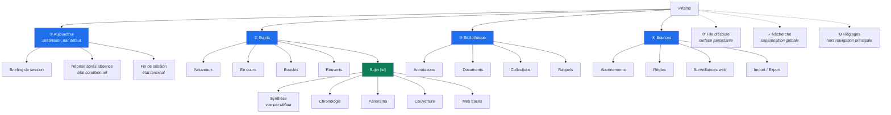
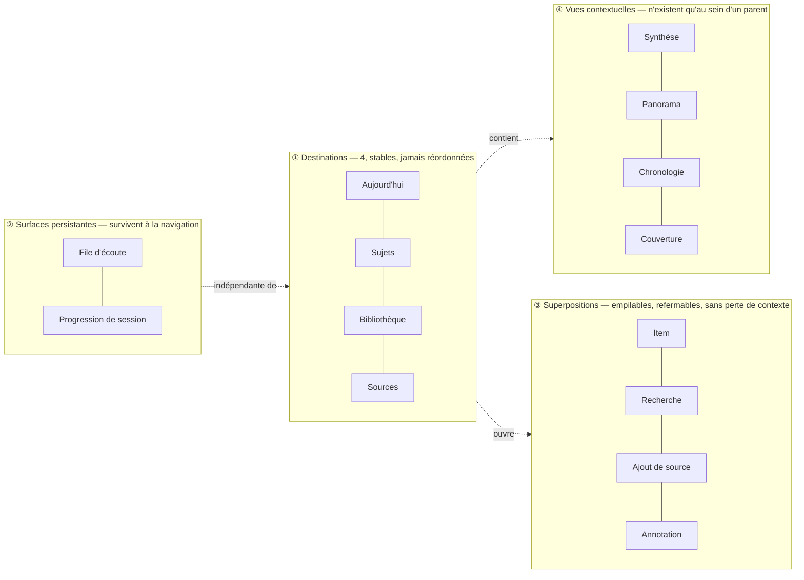
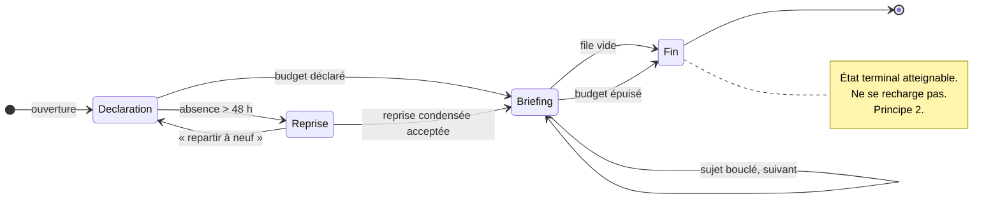
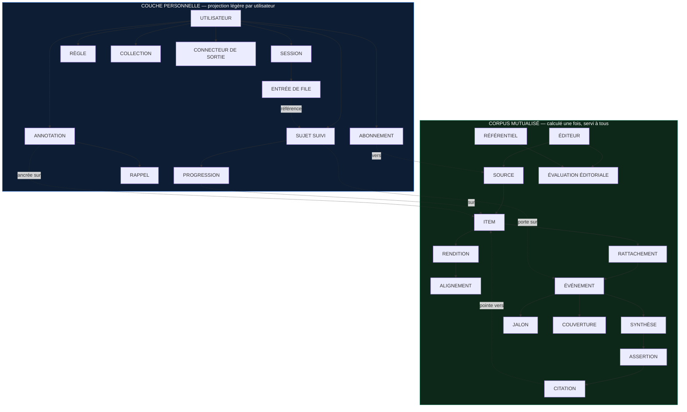
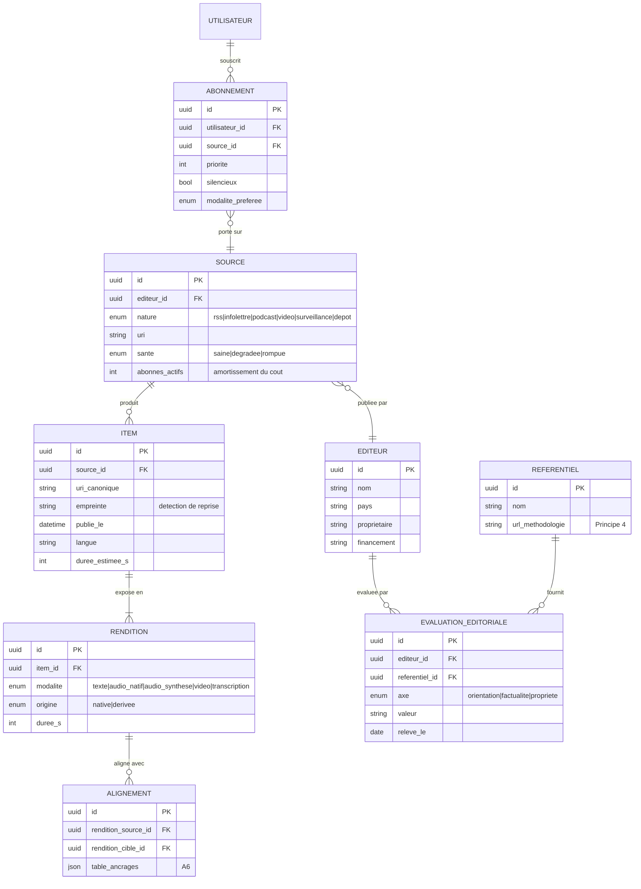
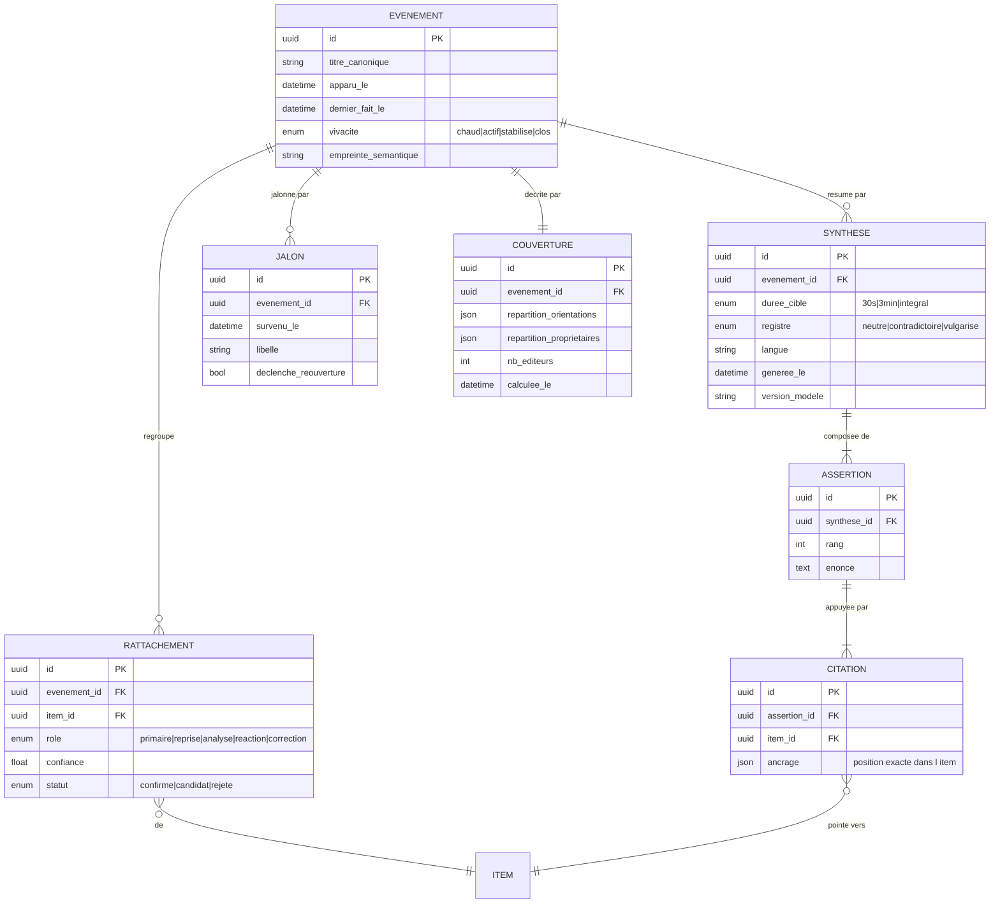
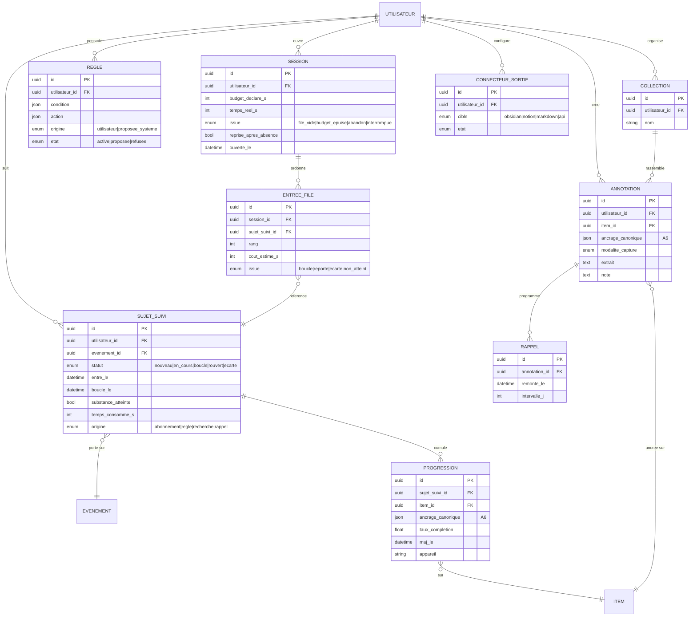
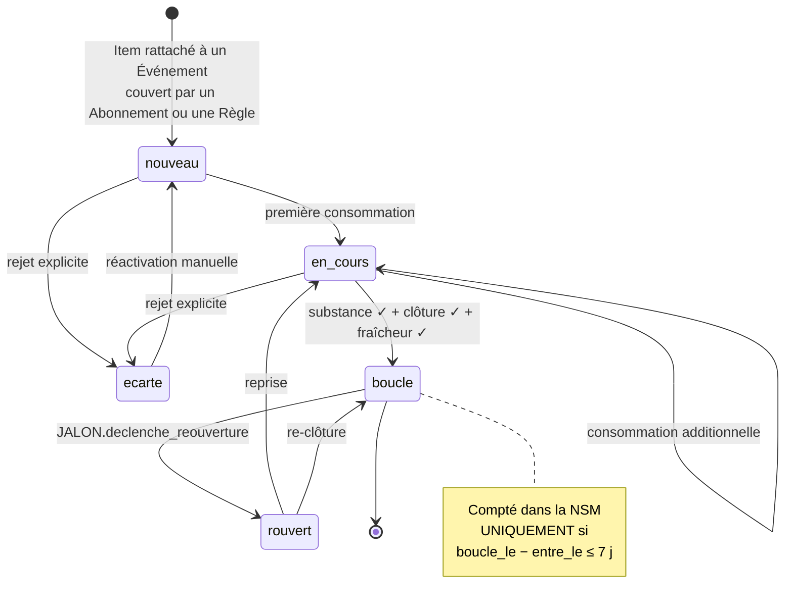
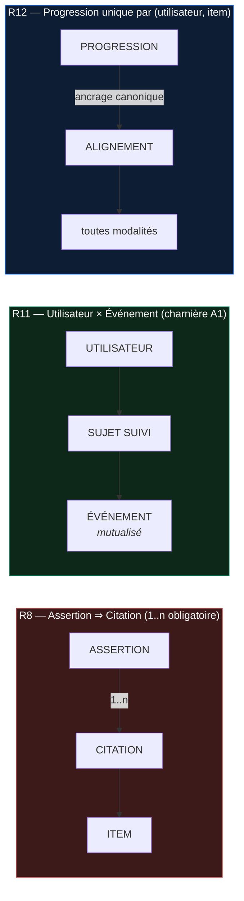

# Architecture du produit — v1

**Prisme — boucle 2**

> **Périmètre** : Sitemap, Navigation principale, Navigation secondaire, Modèle de données, Entités, Relations.
> **Prérequis** : [Socle stratégique v1](strategie-v1.md). Chaque décision ci-dessous est traçable à un pilier ou un principe de la boucle 1 ; celles qui ne le sont pas n'ont pas leur place ici.
> **Hors périmètre** : toujours aucun écran, aucune maquette, aucun composant visuel. On définit la **structure** et le **graphe d'objets**, pas leur rendu.
> **Équipe** : Information Architect · Senior Staff Product Designer · Frontend Architect.

---

## 0. Les sept décisions d'architecture

Tout le reste du document découle de ces sept décisions. Elles sont listées d'abord parce qu'elles sont contestables — et que les contester coûte moins cher maintenant qu'après.

| # | Décision | Origine | Conséquence structurelle |
|---|---|---|---|
| **A1** | **L'Événement est global, le Sujet suivi est personnel.** Le regroupement, la synthèse et le panorama sont calculés **une fois pour tous** ; ce qui est propre à l'utilisateur est une projection légère par-dessus. | §5.4 boucle 1 — l'économie unitaire dépend d'un coût par *événement*, pas par *utilisateur* | Sépare le modèle en deux moitiés : **corpus mutualisé** / **couche personnelle**. C'est ce qui rend l'option tarifaire grand public possible. |
| **A2** | **L'Item n'est jamais une destination de premier rang.** On n'atteint un article que par son Événement, ou par la Bibliothèque si on l'a déjà annoté. | Principe 1 — *l'événement avant l'article* | Il n'existe **aucune route** listant des articles par ordre chronologique. L'absence de cette vue est une décision, pas un oubli. |
| **A3** | **La file est bornée par le budget, pas par le stock.** Ce qui entre dans une session est calculé à partir du temps déclaré, pas de ce qui reste à lire. | Principe 2 — *« fini » est une fonctionnalité* ; Pilier 4 | `Session` porte un budget et un état terminal. Le reliquat n'est jamais affiché comme un retard. |
| **A4** | **Un regroupement non confirmé n'est jamais présenté comme fusionné.** Le rattachement d'un Item à un Événement porte un statut et une confiance ; en dessous du seuil, il s'affiche comme *rapproché*, pas comme *identique*. | Pilier 2, hypothèse de risque — *précision > rappel, sans discussion* | La doctrine devient un attribut du modèle (`RATTACHEMENT.statut`), pas une consigne d'équipe. |
| **A5** | **Aucune Assertion sans Citation.** La contrainte est une cardinalité obligatoire dans le schéma, pas une règle de rédaction. | Principe 5 — *l'IA résume, elle ne remplace pas la source* | `ASSERTION ||--|{ CITATION`. Une synthèse dont une assertion perd sa citation est **invalide** et n'est pas servie. |
| **A6** | **Une position canonique unique, projetée dans chaque modalité.** La progression est stockée sur un ancrage neutre, jamais sur un offset de texte ou un timecode. | Pilier 5 — *une même chose, trois modalités, un seul état* | Impose l'entité `ALIGNEMENT` entre renditions. C'est le coût réel du principe 7, et il est structurel : on ne le rattrape pas après coup. |
| **A7** | **Aucun compteur de non-lus dans la navigation.** Une seule exception : le reste de la session en cours, qui décroît vers zéro. | Principe 9 — *le défaut doit être calme* | Interdit les badges sur `Sujets`, `Sources`, `Bibliothèque`. Le seul nombre visible est un décompte qui **descend**. |

---

## 1. Sitemap complet

### 1.1 Vue d'ensemble



### 1.2 Arborescence détaillée

```
Prisme
│
├── ① Aujourd'hui ......................... destination par défaut, finie
│   ├── Déclaration de budget ............. état d'entrée (10 min / 30 min / tout)
│   ├── Briefing de session ............... file ordonnée, décroissante
│   ├── Reprise après absence ............. état conditionnel (absence > 48 h)
│   └── Fin de session .................... état terminal — « c'est tout »
│       └── Bilan de session .............. ce qui a été bouclé, ce qui a été écarté
│
├── ② Sujets .............................. l'inventaire, jamais un flux
│   ├── Nouveaux
│   ├── En cours
│   ├── Bouclés
│   ├── Rouverts .......................... fait nouveau sur un sujet déjà bouclé
│   ├── Écartés ........................... consultable, jamais mis en avant
│   └── Sujet {id}
│       ├── Synthèse ...................... vue par défaut
│       │   └── sélecteur de durée ........ 30 s / 3 min / intégral
│       ├── Chronologie ................... jalons du sujet dans la durée
│       ├── Panorama
│       │   ├── Répartition éditoriale
│       │   ├── Propriété & financement
│       │   ├── Angle mort personnel ...... « absent de 80 % de vos sources »
│       │   └── Sources complémentaires ... suggestion explicite et refusable
│       ├── Couverture .................... les Items rattachés
│       │   ├── Rattachements confirmés
│       │   ├── Rapprochements non confirmés ... A4 — jamais fusionnés
│       │   └── Item {id} ................. superposition, pas une page
│       └── Mes traces .................... annotations et notes sur ce sujet
│
├── ③ Bibliothèque ........................ la mémoire
│   ├── Annotations ....................... toutes modalités, y compris audio
│   ├── Documents ......................... PDF, EPUB, rapports — hors événement
│   ├── Collections
│   │   └── Collection {id}
│   ├── Rappels ........................... remontée différée
│   └── Recherche unifiée ................. tout ce qui a été consommé
│
├── ④ Sources ............................. la souveraineté
│   ├── Abonnements
│   │   └── Source {id}
│   │       ├── Santé de l'ingestion ...... dernière collecte, taux d'échec
│   │       ├── Profil éditeur ............ orientation, propriété, factualité
│   │       └── Réglages .................. priorité, silence, modalité préférée
│   ├── Ajouter une source ................ URL, e-mail dédié, OPML, surveillance
│   ├── Règles
│   │   ├── Actives
│   │   └── Proposées par le système ...... Pilier 4 — le système propose, l'utilisateur valide
│   ├── Surveillances web ................. pages sans flux
│   └── Import / Export ................... OPML entrant et sortant
│
├── ⟳ File d'écoute ....................... surface persistante, toutes modalités
│   └── Réordonnancement / vitesse / chapitrage
│
├── ⌕ Recherche ........................... superposition accessible partout
│
└── ⚙ Réglages
    ├── Compte & abonnement
    ├── Budget d'attention ................ budgets par défaut, plafond de dette
    ├── Notifications ..................... vide par défaut — opt-in strict
    ├── Modalités & voix
    ├── Confidentialité & données
    ├── Exports & connecteurs ............. Obsidian, Notion, Markdown, API
    └── Méthodologie ...................... Principe 4 — référentiels cités, contestables
```

### 1.3 Ce que le sitemap exclut volontairement

*Note de l'Information Architect : les absences sont la partie signifiante d'un sitemap. Les voici, avec leur justification.*

| Absence | Justification | Ce qu'on perd |
|---|---|---|
| **Aucune destination « Découvrir » / « Explorer »** | Principe 3 — aucune source injectée sans accord. La découverte n'existe que **contextuellement**, dans `Panorama → Sources complémentaires`, attachée à un besoin identifié. | Un levier d'engagement classique, et une partie de l'acquisition virale. Assumé. |
| **Aucune vue « Tous les articles » chronologique** | Décision A2 + Principe 1. | Les utilisateurs venus d'Inoreader chercheront cette vue et ne la trouveront pas. C'est le bon résultat (Principe 1, *ce que ça coûte*). |
| **Aucun compteur de non-lus** | Décision A7 + Principe 9. | Le réengagement par la culpabilité. C'est précisément ce qu'on refuse de vendre. |
| **Aucun flux social, profil public, ou partage interne** | Vision §2 — *ce que la vision refuse*. | Toute boucle virale intra-produit. |
| **Aucune destination « Tendances » / « Populaire »** | La popularité d'un sujet n'est pas un critère de pertinence pour l'utilisateur, et l'introduire ouvre la porte à l'anti-persona A. | Un raccourci de curation facile. |

---

## 2. Navigation principale

### 2.1 Modèle de navigation à quatre couches

*Note du Senior Staff Product Designer : la faute la plus courante à ce stade est de tout traiter comme une « page ». Quatre natures distinctes coexistent et n'obéissent pas aux mêmes règles.*



**Règles de couche, opposables en revue de conception :**

1. Une **destination** ne peut jamais être ouverte au-dessus d'une autre destination. Elle remplace.
2. Une **surface persistante** survit à tout changement de destination et ne perd jamais son état. Elle n'est jamais une destination.
3. Une **superposition** est toujours refermable **sans perte** : la fermer restitue exactement l'état antérieur. Toute superposition dont la fermeture détruit du travail est une erreur de conception.
4. Une **vue contextuelle** n'est jamais atteignable sans son parent. `Panorama` sans Sujet n'existe pas.

### 2.2 Les quatre destinations

| # | Destination | Intention en une phrase | Pilier | Persona porteur | État par défaut | Ce qu'elle ne fait **pas** |
|---|---|---|---|---|---|---|
| ① | **Aujourd'hui** | *Ce que j'ai décidé de comprendre maintenant, dans le temps que j'ai déclaré.* | P4 — Budget d'attention | P2 (Marc) | Déclaration de budget, puis file décroissante | N'affiche jamais l'arriéré total. Ne se recharge pas quand elle est vide. |
| ② | **Sujets** | *Tout ce que je suis, et où j'en suis.* | P2 — Résolution en événements | P1 (Nadia) | `En cours`, trié par vivacité du sujet | N'est pas un flux. Ne se met pas à jour sous les yeux de l'utilisateur pendant la lecture. |
| ③ | **Bibliothèque** | *Ce que j'ai compris, et que je peux remobiliser.* | P6 — Mémoire | P3 (Inès), P4 (Tomás) | `Annotations`, tri par consultation récente | Ne cherche pas dans ce qui n'a pas été consommé — pour ça, c'est `Sujets`. |
| ④ | **Sources** | *Ce que j'ai choisi de laisser entrer.* | P1 — Ingestion souveraine | P1 (Nadia), P4 (Tomás) | `Abonnements`, groupés par éditeur | Ne recommande rien de sa propre initiative. |

### 2.3 L'arbitrage contesté : `Sources` en navigation principale

C'est la seule décision de navigation sur laquelle l'équipe n'est pas unanime, donc elle est documentée comme telle.

| Position | Argument |
|---|---|
| **Contre** (rétrograder `Sources` vers les réglages) | Pour P2 — le persona qui justifie la mission — la gestion de sources est du bruit. Une destination sur quatre consacrée à une tâche de configuration est un mauvais ratio. |
| **Pour** (statu quo, retenu) | Principe 3 — *l'utilisateur possède ses sources*. Enterrer la souveraineté dans les réglages, c'est la démentir. Une capacité qu'on doit chercher est une capacité qu'on ne possède pas. |
| **Rejeté** | Une navigation **adaptative** qui masquerait `Sources` pour les profils de type P2. La stabilité positionnelle prime : une navigation qui bouge selon un profil inféré rend le produit inapprenable et contredit A7 (pas de comportement décidé pour l'utilisateur). |

**Arbitrage retenu :** quatre destinations fixes pour tous. La charge d'entrée de P2 est traitée par un **onboarding sans configuration** (Pilier 1, hypothèse de risque : produire de la valeur avant toute configuration), pas par un masquage de navigation.

### 2.4 Déclinaison par plateforme

| Plateforme | Destinations | Surfaces persistantes | Superpositions | Note |
|---|---|---|---|---|
| **Mobile** | Barre inférieure, 4 onglets, ordre figé | Lecteur réduit au-dessus de la barre ; progression de session en tête de `Aujourd'hui` | Feuilles montantes, empilables jusqu'à 2 niveaux | Au-delà de 2 niveaux, la fermeture devient imprévisible : contrainte dure. |
| **Tablette / Bureau** | Rail latéral, 4 entrées + recherche | Lecteur en pied de rail ; progression en tête de colonne | Panneaux latéraux ou modales centrées | Le détail d'un Sujet exploite deux colonnes : liste des Sujets + vue contextuelle. |
| **Web** | Identique au bureau, **avec URL adressable à chaque niveau** | Idem | Modales avec route dédiée (§ annexe A) | L'adressabilité est une exigence de P3 (Inès) — citer, c'est pouvoir pointer. |

---

## 3. Navigation secondaire

### 3.1 Principe général

La navigation secondaire est **toujours locale à une destination** et ne franchit jamais sa frontière. Aucune vue contextuelle n'est partagée entre deux destinations : si deux destinations semblent avoir besoin de la même sous-vue, c'est un défaut de modèle, pas une opportunité de réutilisation.

### 3.2 ① Aujourd'hui — navigation par **état**, pas par onglets

C'est la seule destination sans navigation secondaire visible. Elle est une **machine à états** : l'utilisateur n'y choisit pas une vue, il progresse.



| État | Déclencheur d'entrée | Sortie |
|---|---|---|
| **Déclaration de budget** | Ouverture de la destination | Budget choisi, ou reprise du dernier budget utilisé |
| **Reprise après absence** | Dernière session > 48 h | Condensé accepté (la dette est soldée, pas reportée) ou repartir à neuf |
| **Briefing** | Budget déclaré | Sujet suivant, jusqu'à épuisement de la file ou du budget |
| **Fin de session** | File vide **ou** budget épuisé | État terminal. Bilan : bouclés, écartés, temps réel vs budget. |

*Décision de conception :* le budget épuisé et la file vide mènent au **même état terminal**, avec un libellé différent. Ne pas distinguer visuellement « tu as fini » de « tu n'as plus le temps » serait un mensonge ; en faire deux états séparés réintroduirait la culpabilité (E1). Un état, deux formulations.

### 3.3 ② Sujets — navigation par **statut**, puis par sujet

**Niveau 1 — filtres de statut** (segments, exclusifs) :

| Segment | Contenu | Tri par défaut | Visible par défaut |
|---|---|---|---|
| Nouveaux | Entrés depuis la dernière session | Vivacité du sujet | ✅ |
| **En cours** | Substance entamée, non bouclés | Vivacité du sujet | ✅ *(défaut)* |
| Bouclés | Les 3 conditions NSM satisfaites | Date de clôture | ✅ |
| Rouverts | Fait nouveau après clôture | Date de réouverture | ✅ |
| Écartés | Rejetés explicitement | Date d'écartement | ⬚ *(replié)* |

**Niveau 2 — vues contextuelles d'un Sujet.** C'est la navigation secondaire la plus importante du produit : c'est là que la thèse se démontre ou échoue.

| Onglet | Répond au job | Contenu | Pourquoi à cette place |
|---|---|---|---|
| **Synthèse** *(défaut)* | F2, job principal | Synthèse à durée choisie, chaque assertion citée | La durée choisie **est** la promesse — elle doit être le premier geste possible. |
| **Chronologie** | F7 | Jalons datés, réouvertures marquées | Sépare *ce qui s'est passé* de *ce qu'on en dit*. |
| **Panorama** | F3, S2 | Répartition éditoriale · propriété · angle mort personnel · sources complémentaires | Sous le Sujet et non en destination : la transparence n'a de sens qu'appliquée à quelque chose. |
| **Couverture** | F1 | Rattachements confirmés / rapprochements non confirmés (A4) | Le seul chemin vers un Item (A2). |
| **Mes traces** | F5 | Annotations et notes portant sur ce Sujet | Fenêtre locale sur la Bibliothèque, pas un doublon : filtrée par Sujet, en lecture-écriture. |

### 3.4 ③ Bibliothèque — navigation par **nature d'objet**

| Onglet | Contenu | Tri par défaut | Note |
|---|---|---|---|
| **Annotations** *(défaut)* | Toutes modalités, ancrage canonique (A6) | Consultation récente | Une annotation audio et une annotation texte sont le même objet. |
| Documents | PDF, EPUB, rapports — sans nature d'événement | Ajout récent | Le seul endroit où un contenu vit hors du modèle Événement. |
| Collections | Regroupements créés par l'utilisateur | Manuel | Jamais automatique — sinon on recrée un algorithme de curation. |
| Rappels | Remontées différées programmées | Date de remontée | Se déverse dans `Aujourd'hui` sans jamais notifier (Principe 9). |

### 3.5 ④ Sources — navigation par **cycle de vie**

| Onglet | Contenu | Note |
|---|---|---|
| **Abonnements** *(défaut)* | Groupés par éditeur, pas par dossier | Le groupement par éditeur rend le Panorama lisible ; les dossiers thématiques restent possibles comme étiquettes. |
| Règles → *Actives* | Règles en vigueur | |
| Règles → **Proposées** | Règles déduites du comportement, en attente de validation | Matérialise l'inversion du Pilier 4 : le système propose, l'utilisateur valide. Sans cet onglet, l'inversion n'existe pas. |
| Surveillances web | Pages sans flux | Le savoir-faire Inoreader, devenu indispensable. |
| Import / Export | OPML entrant et sortant | Accessible **sans compte payant** — Principe 3. |

### 3.6 Règles transverses de navigation secondaire

| Règle | Justification |
|---|---|
| Le segment actif est **conservé par destination** entre les sessions. | Réduit le coût de reprise pour P1, qui revient deux fois par jour au même endroit. |
| Aucun onglet secondaire ne porte de badge ni de compteur. | A7 / Principe 9. |
| Un onglet vide reste **visible et libellé**, jamais masqué. | Une navigation qui change de forme selon les données est inapprenable. |
| Toute vue contextuelle est **adressable** (URL, lien profond). | Exigence de P3 : citer, c'est pouvoir pointer. |
| La recherche est une superposition, jamais un onglet. | Elle traverse les quatre destinations ; en faire un onglet la rattacherait à tort à l'une d'elles. |

---

## 4. Modèle de données

### 4.1 Vue macroscopique — la ligne de partage

La décision A1 découpe le modèle en deux moitiés dont l'économie diffère radicalement.



**Conséquence économique, qui répond à la question ouverte n°1 de la boucle 1 :** le coût marginal d'un utilisateur supplémentaire est celui de sa couche personnelle — quelques milliers de lignes légères. Le coût lourd (extraction, regroupement, synthèse, panorama) est **amorti sur tous les utilisateurs partageant une source**. Il croît avec la taille du corpus, pas avec la base installée. C'est la condition de faisabilité de l'option tarifaire grand public recommandée en §5.4 de la boucle 1 — et **le corollaire à surveiller** : la longue traîne (une source lue par un seul utilisateur) porte un coût non amorti. Le modèle doit permettre de la mesurer dès le premier jour ; c'est le rôle de `SOURCE.abonnes_actifs`.

### 4.2 Domaine 1 — Ingestion et sources



### 4.3 Domaine 2 — Résolution et panorama



### 4.4 Domaine 3 — Attention et mémoire



### 4.5 Le cycle de vie d'un Sujet suivi

C'est la machine à états qui produit la North Star Metric. Elle est donc la partie du modèle la plus sensible aux erreurs de définition.



**Point de vigilance sur l'instrumentation.** Un `SUJET_SUIVI` bouclé au-delà de 7 jours reste `boucle` dans le modèle — il ne bascule pas dans un statut dégradé. C'est le **calcul** de la NSM qui applique le filtre de fraîcheur, pas le statut. Confondre les deux amènerait à afficher à l'utilisateur un jugement sur sa lenteur, ce qu'interdit E1 (« clôture, pas culpabilité »).

### 4.6 Vues dérivées — calculées, jamais stockées comme vérité

*Note du Frontend Architect : ces quatre vues sont les métriques de la boucle 1. Les stocker comme attributs les rendrait divergentes et ingagnables à réconcilier. Elles sont recalculées à la demande à partir des entités ci-dessus.*

| Vue dérivée | Formule | Alimente | Exposée à l'utilisateur |
|---|---|---|---|
| **SBU hebdomadaire** | `count(SUJET_SUIVI où statut='boucle' ET substance_atteinte ET boucle_le − entre_le ≤ 7j)` par semaine et par utilisateur actif | North Star Metric | ❌ Métrique interne |
| **Dette informationnelle** | `median(maintenant − entre_le)` sur `SUJET_SUIVI` de statut `nouveau` ou `en_cours` | Garde-fou · `Aujourd'hui` | ✅ Sous forme d'action proposée, jamais de reproche |
| **Angle mort personnel** | `1 − (éditeurs de l'utilisateur couvrant l'Événement / éditeurs total de COUVERTURE)` | Pilier 3 · `Panorama` | ✅ **Le différenciateur vs Ground News** — calculé sur le corpus de l'utilisateur |
| **Indice de pluralité** | `% de SUJET_SUIVI bouclés dont la COUVERTURE consommée comporte ≥ 2 orientations distinctes` | Garde-fou | ✅ Dans le tableau de bord d'exposition |

---

## 5. Entités

### 5.1 Corpus mutualisé — 13 entités

| Entité | Définition | Attributs déterminants | Existe à cause de |
|---|---|---|---|
| **ÉDITEUR** | L'organisation qui publie. Distincte de ses canaux : *Le Monde* RSS et *Le Monde* infolettre sont deux Sources d'un même Éditeur. | `proprietaire`, `financement` | Pilier 3 — sans cette distinction, le panorama compte plusieurs fois la même voix. |
| **SOURCE** | Un canal d'ingestion concret et adressable. | `nature`, `sante`, `abonnes_actifs` | Pilier 1. `abonnes_actifs` mesure l'amortissement (§4.1). |
| **ITEM** | Une unité de contenu retrouvée sur une Source. | `uri_canonique`, `empreinte` | Unité atomique. `empreinte` porte la détection de reprise de dépêche. |
| **RENDITION** | Une expression d'un Item dans une modalité. | `modalite`, `origine` | Pilier 5. Un Item a ≥ 1 Rendition, toujours. |
| **ALIGNEMENT** | Table de correspondance de positions entre deux Renditions. | `table_ancrages` | **A6.** L'entité qui rend « un seul état » réalisable. |
| **ÉVÉNEMENT** | Un fait du monde autour duquel des Items se regroupent. | `vivacite`, `dernier_fait_le` | Pilier 2. L'unité de valeur du produit. |
| **RATTACHEMENT** | Le lien Item ↔ Événement, **qualifié**. | `role`, `confiance`, `statut` | **A4.** Le lien porte le doute au lieu de le masquer. |
| **JALON** | Un fait daté dans la vie d'un Événement. | `declenche_reouverture` | Chronologie + réouverture automatique. |
| **SYNTHÈSE** | Une restitution générée d'un Événement, pour une durée, un registre et une langue. | `duree_cible`, `registre`, `version_modele` | Job principal. Mutualisable → A1. `version_modele` permet la régénération auditable. |
| **ASSERTION** | Une affirmation atomique d'une Synthèse. | `rang`, `enonce` | **A5.** Découper la synthèse en assertions est ce qui rend l'attribution ligne à ligne possible. |
| **CITATION** | Le lien Assertion → position exacte dans un Item. | `ancrage` | **A5** + Principe 5 + job S2. |
| **COUVERTURE** | L'état global de la couverture d'un Événement. | `repartition_orientations`, `nb_editeurs` | Pilier 3. Globale ; le versant personnel est dérivé (§4.6). |
| **RÉFÉRENTIEL** | La source externe d'une évaluation éditoriale. | `url_methodologie` | Principe 4 — *méthodologie publique et contestable*. Sans cette entité, on redevient juge. |

*(**ÉVALUATION ÉDITORIALE** est la table de jonction Éditeur × Référentiel × axe — datée, car une orientation éditoriale n'est pas éternelle.)*

### 5.2 Couche personnelle — 11 entités

| Entité | Définition | Attributs déterminants | Existe à cause de |
|---|---|---|---|
| **UTILISATEUR** | Le compte. | `budget_defaut_s`, `plafond_dette_j` | Le budget est une propriété du compte, pas un réglage caché. |
| **ABONNEMENT** | Le lien Utilisateur → Source, avec ses réglages. | `priorite`, `silencieux`, `modalite_preferee` | Pilier 1. Rend la Source mutualisable (A1). |
| **SUJET SUIVI** | La projection personnelle d'un Événement. **L'entité centrale du produit.** | `statut`, `entre_le`, `boucle_le`, `substance_atteinte` | Pilier 4 + North Star. |
| **PROGRESSION** | L'avancement sur un Item, en ancrage canonique. | `ancrage_canonique`, `taux_completion` | **A6.** Un seul enregistrement par (utilisateur, item), toutes modalités et tous appareils confondus. |
| **SESSION** | Une occurrence de consommation bornée par un budget. | `budget_declare_s`, `issue` | **A3** + Principe 2. `issue` alimente le garde-fou « taux de session close ». |
| **ENTRÉE DE FILE** | Un Sujet placé dans une Session, à un rang, avec un coût estimé. | `rang`, `cout_estime_s`, `issue` | **A3.** `cout_estime_s` est ce qui permet de borner la file par le temps et non par le stock. |
| **RÈGLE** | Une automatisation du tri. | `origine`, `etat` | Pilier 4. `origine='proposee_systeme'` matérialise l'inversion : le système propose, l'utilisateur valide. |
| **ANNOTATION** | Un passage retenu, avec sa note. | `ancrage_canonique`, `modalite_capture` | Pilier 6. Ancrage canonique → une annotation posée à l'oreille se retrouve dans le texte. |
| **RAPPEL** | Une remontée différée. | `remonte_le`, `intervalle_j` | Pilier 6. Se déverse dans `Aujourd'hui`, **ne notifie jamais** (Principe 9). |
| **COLLECTION** | Un regroupement manuel. | `nom` | Pilier 6. Jamais automatique. |
| **CONNECTEUR DE SORTIE** | Une destination d'export. | `cible`, `etat` | Principe 3 + Pilier 6 — condition d'entrée de P4 (Tomás). |

### 5.3 Ce que le modèle ne contient pas

| Entité absente | Pourquoi elle serait tentante | Pourquoi elle est refusée |
|---|---|---|
| `SCORE_CREDIBILITE` maison | Simplifierait énormément le tri. | Principe 4. Nous n'attribuons pas de note ; nous relayons des référentiels cités. |
| `FLUX` / `TIMELINE` | Structure de données naturelle pour un produit d'information. | A2 + Principe 1. Il n'y a pas de flux à modéliser, donc pas d'entité à créer. |
| `SERIE` / `STREAK` | Levier de rétention éprouvé. | Principe 9 + persona P2, *ce qu'il ne veut surtout pas*. |
| `TENDANCE` / `POPULARITE` | Curation facile et peu coûteuse. | La popularité n'est pas de la pertinence, et elle ouvre la porte à l'anti-persona A. |
| `AMI` / `PARTAGE_INTERNE` | Boucle virale. | Vision §2 — pas un réseau social. |

---

## 6. Relations

### 6.1 Table des relations structurantes

| # | Relation | Cardinalité | Contrainte d'intégrité | Justification |
|---|---|---|---|---|
| R1 | ÉDITEUR → SOURCE | `1 — 0..n` | Une Source appartient à exactement un Éditeur | Le panorama compte des **voix**, pas des canaux. |
| R2 | SOURCE → ITEM | `1 — 0..n` | Suppression de Source : les Items sont conservés | Un Item cité dans une Annotation doit survivre au désabonnement. |
| R3 | ITEM → RENDITION | `1 — 1..n` | **Au moins une** Rendition | Un Item sans expression consommable n'existe pas. |
| R4 | RENDITION ↔ RENDITION *(via ALIGNEMENT)* | `n — n` | Alignement obligatoire entre deux Renditions d'un même Item dès qu'une Progression existe | **A6.** Sans lui, la continuité multimodale est une promesse creuse. |
| R5 | ÉVÉNEMENT → RATTACHEMENT → ITEM | `n — n` **qualifiée** | `statut='confirme'` requiert `confiance ≥ seuil` | **A4.** La doctrine précision > rappel est une contrainte, pas une intention. |
| R6 | ÉVÉNEMENT → SYNTHÈSE | `1 — 0..n` | Unique par `(événement, durée, registre, langue)` | Mutualisation (A1) : une Synthèse sert tous les utilisateurs qui la demandent. |
| R7 | SYNTHÈSE → ASSERTION | `1 — 1..n` | Une Synthèse vide est invalide | Une synthèse sans assertion n'est pas une synthèse. |
| R8 | **ASSERTION → CITATION** | `1 — 1..n` | **Au moins une Citation, obligatoire** | **A5 / Principe 5.** *La relation la plus importante du modèle* : elle interdit le contenu orphelin au niveau du schéma. Une Assertion qui perd sa dernière Citation rend la Synthèse entière non servable. |
| R9 | CITATION → ITEM | `n — 1` | Ancrage résolvable, sinon la Citation est invalide | Job S2 — la traçabilité est binaire, jamais approximative. |
| R10 | UTILISATEUR → ABONNEMENT → SOURCE | `n — n` | Unique par `(utilisateur, source)` | Rend la Source mutualisable — pilier de A1. |
| R11 | UTILISATEUR → SUJET SUIVI → ÉVÉNEMENT | `n — n` | Unique par `(utilisateur, événement)` | **La relation charnière** entre les deux moitiés du modèle. |
| R12 | SUJET SUIVI → PROGRESSION → ITEM | `n — n` | Unique par `(utilisateur, item)`, **toutes modalités confondues** | **A6.** Deux Progressions sur le même Item pour un même utilisateur = bug, pas cas limite. |
| R13 | SESSION → ENTRÉE DE FILE → SUJET SUIVI | `n — n` | `somme(cout_estime_s) ≤ budget_declare_s` **au moment du remplissage** | **A3.** Le budget borne la file **à la construction**. Il ne la tronque pas à l'affichage. |
| R14 | ÉVÉNEMENT → JALON | `1 — 0..n` | `declenche_reouverture` bascule les SUJET SUIVI de statut `boucle` vers `rouvert` | Réouverture automatique (Pilier 2). Effet de bord assumé et à surveiller. |
| R15 | ANNOTATION → ITEM | `n — 1` | Ancrage canonique, indépendant de la modalité de capture | Pilier 6 + A6. |
| R16 | ANNOTATION → RAPPEL | `1 — 0..n` | Un Rappel échu entre dans `Aujourd'hui`, **jamais en notification** | Principe 9. |
| R17 | ÉDITEUR → ÉVALUATION ÉDITORIALE ← RÉFÉRENTIEL | `n — n` **datée** | Toute Évaluation cite son Référentiel et sa date de relevé | Principe 4. Une évaluation sans référentiel citable n'entre pas dans le système. |

### 6.2 Les trois relations qui portent la thèse

Si l'implémentation devait sacrifier des raffinements, ces trois-là ne sont pas négociables — chacune est la traduction technique d'une promesse commerciale.



| Relation | Promesse commerciale correspondante | Ce qui casse si on la relâche |
|---|---|---|
| **R8** | *« Chaque affirmation ramène à sa source. »* | Le produit devient un générateur de texte plausible. Perte de P1 et P3, exposition juridique, et rupture du Principe 10 envers les éditeurs. |
| **R11** | *« Un prix accessible, malgré une IA coûteuse. »* | Le coût redevient proportionnel à la base installée. L'option tarifaire grand public meurt — et avec elle la mission sur P2. |
| **R12** | *« Commencez à lire, finissez à l'oreille. »* | Chaque modalité redevient un silo. Pilier 5 annulé, et le produit retombe au niveau de l'existant. |

### 6.3 Cascades de suppression

*Note du Frontend Architect : point systématiquement traité trop tard, et qui devient irréparable une fois des données en production.*

| Action | Effet en cascade | Justification |
|---|---|---|
| Désabonnement d'une Source | `ABONNEMENT` supprimé · `ITEM` **conservés** · `SUJET SUIVI` existants **conservés** · aucun nouvel Item ingéré | Se désabonner n'est pas effacer son passé. |
| Suppression d'un Item du corpus | `CITATION` invalidées → `ASSERTION` orphelines → **`SYNTHÈSE` marquée non servable et régénérée** | R8. Une synthèse partiellement sourcée n'est pas servie. |
| Rejet d'un Rattachement candidat | `RATTACHEMENT.statut='rejete'` · l'Item redevient éligible à un autre Événement · **`COUVERTURE` recalculée** | A4. Le rejet est réversible et traçable, jamais destructif. |
| Suppression de compte | Couche personnelle **entièrement** supprimée · corpus mutualisé intact · export proposé **avant** confirmation | Principe 3 — la portabilité vaut particulièrement au moment du départ. |

---

## Annexe A — Schéma de routes *(Frontend Architect)*

L'adressabilité n'est pas un détail d'implémentation : c'est la condition du job S2 (citer, c'est pouvoir pointer) et de tout le persona P3.

| Route | Nature | Destination parente | Note |
|---|---|---|---|
| `/` | Redirection | — | → `/aujourdhui` |
| `/aujourdhui` | Destination | ① | Non partageable — état personnel |
| `/sujets` | Destination | ② | `?statut=en_cours` par défaut |
| `/sujets/:id` | Vue contextuelle | ② | → `/sujets/:id/synthese` |
| `/sujets/:id/synthese` | Vue contextuelle | ② | `?duree=3min&registre=neutre` |
| `/sujets/:id/chronologie` | Vue contextuelle | ② | |
| `/sujets/:id/panorama` | Vue contextuelle | ② | |
| `/sujets/:id/couverture` | Vue contextuelle | ② | |
| `/sujets/:id/traces` | Vue contextuelle | ② | |
| `/sujets/:id/item/:itemId` | **Superposition** | ② | Route dédiée : rendue en superposition au-dessus du Sujet, ouvrable en direct si accès profond |
| `/bibliotheque/{annotations,documents,collections,rappels}` | Destination | ③ | |
| `/sources`, `/sources/:id`, `/sources/regles` | Destination | ④ | |
| `/recherche` | **Superposition** | globale | `?q=` — préserve la destination sous-jacente |
| `/reglages/*` | Hors navigation | — | |

**Règle :** l'état du lecteur (file d'écoute, position, vitesse) **n'est jamais dans l'URL**. C'est une surface persistante (§2.1, règle 2) ; l'inscrire dans la route la transformerait en destination et casserait sa persistance.

## Annexe B — Autorité et synchronisation *(Frontend Architect)*

Le hors-ligne complet (Pilier 5) et la position partagée entre appareils (A6) imposent de trancher l'autorité entité par entité.

| Entité | Autorité | Stratégie | Résolution de conflit |
|---|---|---|---|
| Corpus mutualisé (Item, Événement, Synthèse…) | Serveur | Lecture seule côté client, cache agressif | Sans objet |
| `PROGRESSION` | **Client, réconcilié** | Écriture locale immédiate, poussée différée | **Ancrage le plus avancé gagne**, jamais le plus récent — reculer la position d'un utilisateur est le pire résultat possible |
| `ANNOTATION` | Client | Local-first, synchro à la reconnexion | Fusion ; jamais d'écrasement. Une annotation perdue est une rupture de confiance irrécupérable (P3, P4) |
| `SUJET_SUIVI.statut` | **Serveur** | Transition validée côté serveur | Le serveur arbitre : la NSM en dépend, elle ne peut pas être calculée sur un état client |
| `SESSION` | Client, puis scellée | Construite localement, scellée à la clôture | Une Session non scellée à J+1 est close en `interrompue` |
| `ABONNEMENT`, `REGLE` | Serveur | Écriture optimiste | Dernière écriture gagne |

---

## Ce que cette boucle ne tranche pas

1. **Le seuil de confiance de `RATTACHEMENT.statut='confirme'`.** Il détermine le compromis précision/rappel du pilier 2. Il est calibrable, pas devinable — il exige un corpus annoté. **Préalable à toute implémentation de la résolution en événements.**
2. **L'algorithme d'ordonnancement de `ENTREE_FILE`.** Le modèle dit *comment* la file est bornée (R13) ; il ne dit pas *ce qui passe en premier*. C'est un problème de conception à part entière, et probablement le second différenciateur du produit après le regroupement.
3. **La granularité de l'`ancrage_canonique`.** Paragraphe, phrase, ou intervalle de caractères ? Décision à fort impact sur la qualité des Citations (R8) et le coût des Alignements (R4).
4. **Le modèle multi-appareils de `SESSION`.** Une session commencée sur mobile et poursuivie sur bureau est-elle une session ou deux ? La réponse change le calcul du garde-fou « taux de session close ».
5. **Les questions ouvertes de la boucle 1 restent ouvertes**, sauf la n°1 : l'économie unitaire trouve ici sa réponse **structurelle** (A1, §4.1). Sa réponse **chiffrée** demande encore une mesure du coût par événement et du poids réel de la longue traîne.
