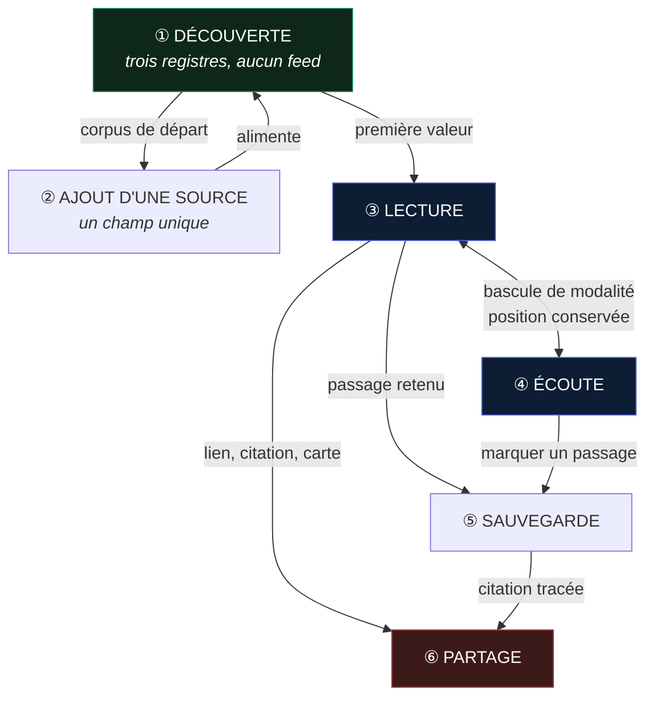
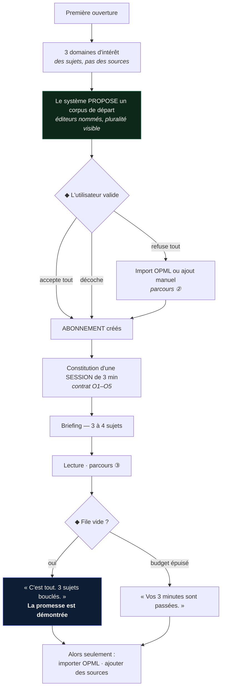
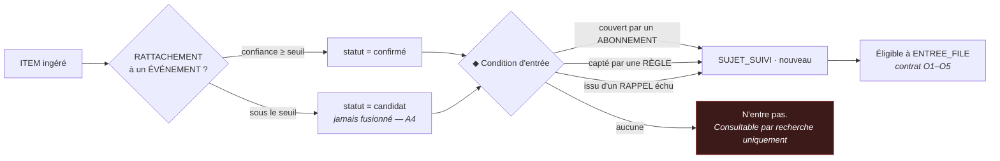
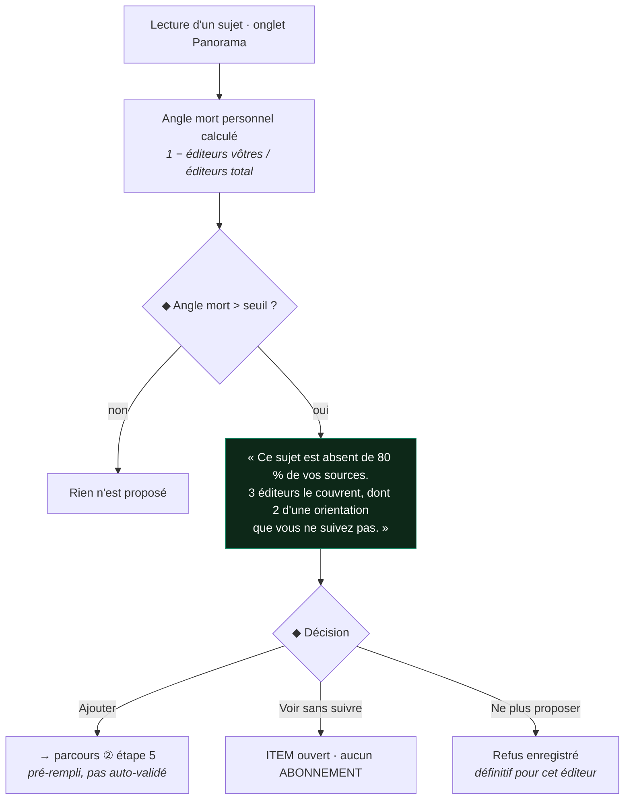
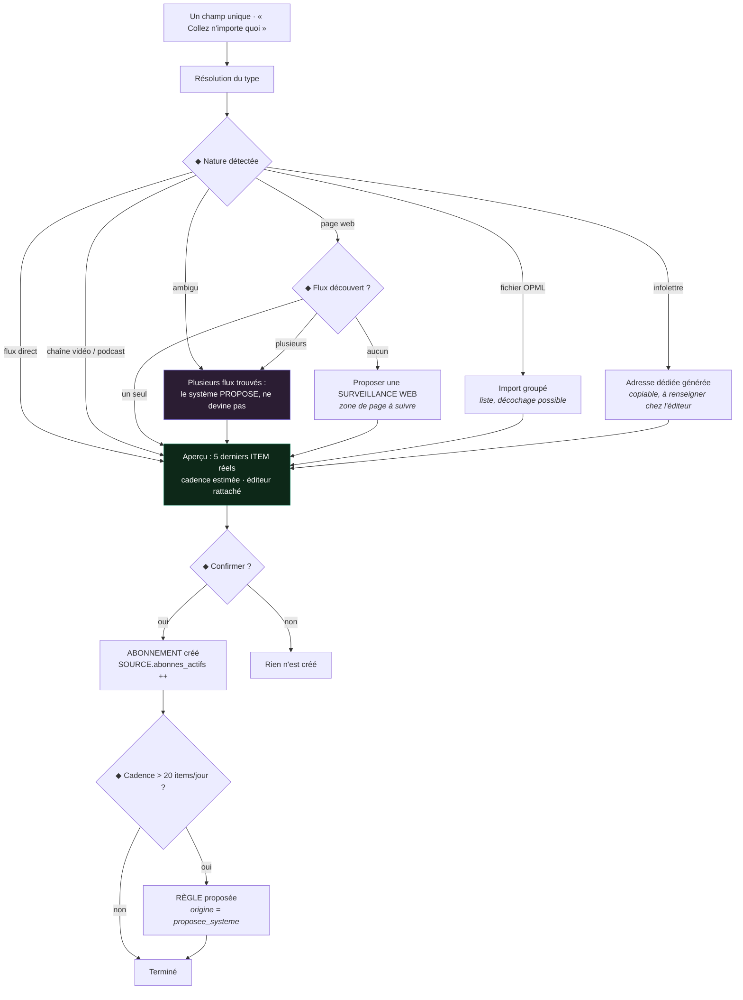
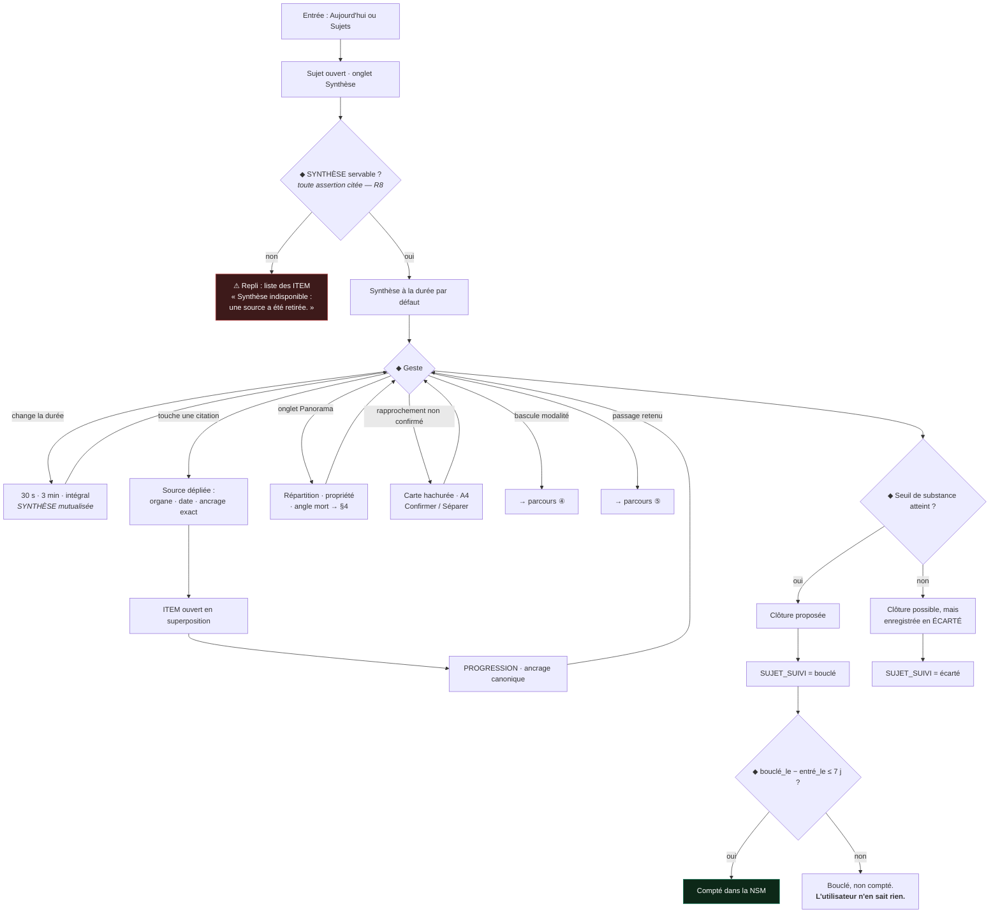
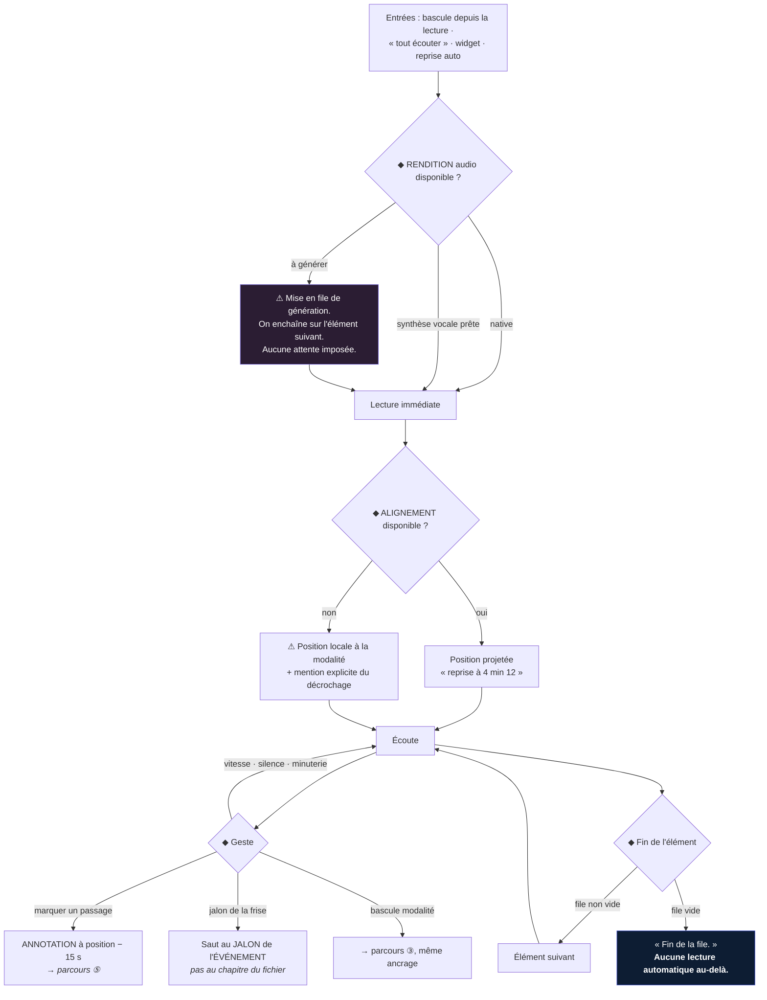
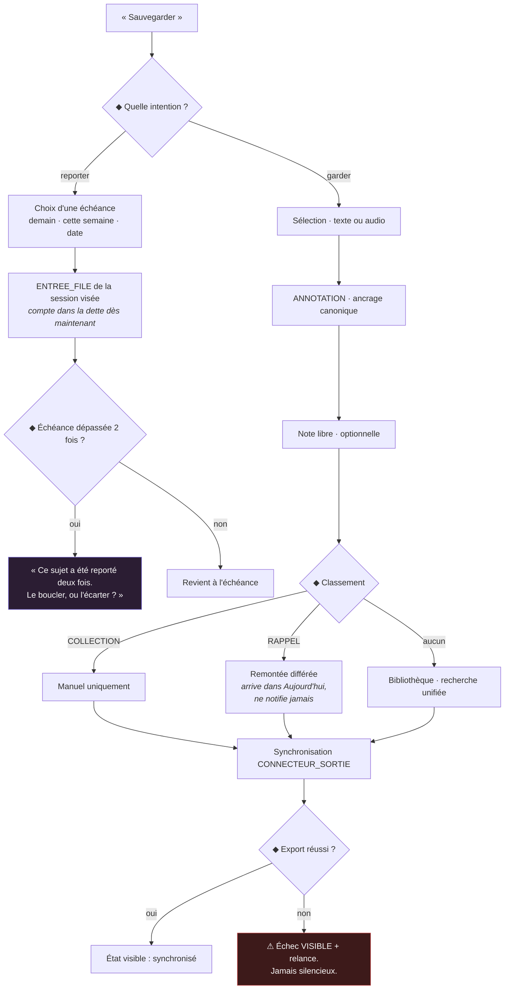
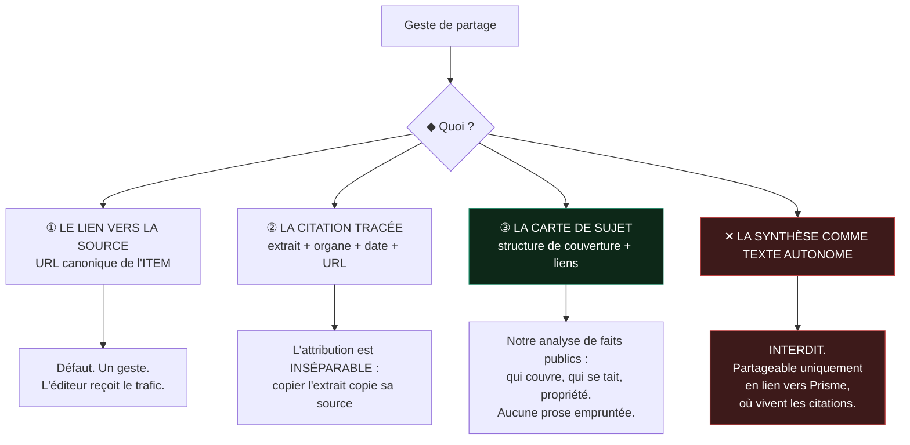

# Parcours utilisateur — v1

**Prisme — boucle 4**

> **Périmètre** : six parcours complets — découverte, ajout d'une source, lecture, écoute, sauvegarde, partage.
> **Prérequis** : [Stratégie](strategie-v1.md) · [Architecture](architecture-v1.md) · [Système de design](../design/systeme-v1.md).
> **Hors périmètre** : toujours aucun écran assemblé. Un parcours décrit des **gestes, des états et des transitions d'entités**, pas des mises en page.
> **Équipe** : Senior UX Designer · Product Designer.

---

## 0. Deux collisions à traiter d'entrée

Deux des six parcours demandés se heurtent à des interdits posés dans les boucles précédentes. Les contourner en douce produirait un produit incohérent ; les traiter frontalement donne les deux meilleures décisions de cette boucle.

| Parcours | Collision | Résolution |
|---|---|---|
| **Découverte** | La boucle 2 supprime toute destination « Découvrir », et le Principe 3 interdit d'injecter une source non choisie. Il n'y a **pas de flux d'exploration** dans ce produit. | La découverte existe sur **trois registres**, tous explicites et tous refusables : découvrir le **produit** (§2), découvrir des **sujets** (§3), découvrir des **sources** (§4). Aucun n'est un feed. |
| **Partage** | La boucle 1 refuse le réseau social ; la boucle 2 ne modélise ni ami ni partage interne. Le Principe 5 impose l'attribution ligne à ligne, le Principe 10 impose que les sources y gagnent. | **Trois objets partageables et un interdit** (§9). L'interdit — diffuser la synthèse comme texte autonome — est la décision la plus lourde de cette boucle. |

### 0.1 Carte d'ensemble

### 0.2 Ce que chaque parcours fait avancer

| Parcours | Entités créées ou mutées | Condition North Star servie |
|---|---|---|
| ① Découverte | `ABONNEMENT`, `SUJET_SUIVI` (nouveau), `SESSION` | Alimente la file — sans elle, aucun sujet à boucler |
| ② Ajout d'une source | `SOURCE`, `EDITEUR`, `ABONNEMENT`, `REGLE` (proposée) | Idem, en amont |
| ③ Lecture | `PROGRESSION`, `SUJET_SUIVI.statut`, `RATTACHEMENT.statut` | **Substance** + **clôture** — les deux conditions décisives |
| ④ Écoute | `PROGRESSION` (même enregistrement), `ANNOTATION` | **Substance**, dans un créneau autrement perdu |
| ⑤ Sauvegarde | `ANNOTATION`, `COLLECTION`, `RAPPEL`, `CONNECTEUR_SORTIE` | Aucune directement — sert la rétention, pas la métrique |
| ⑥ Partage | Aucune mutation | Aucune. **Volontairement non optimisé** (§9.5) |

### 0.3 Une dépendance assumée

Trois de ces parcours supposent qu'un ordre existe dans la file. **L'algorithme d'ordonnancement de `ENTREE_FILE` n'est toujours pas tranché** — je l'avais signalé en fin de boucle 2 et cette boucle ne le résout pas.

Plutôt que de bloquer, les parcours s'appuient sur un **contrat**, que l'ordonnancement devra respecter quel qu'il soit :

| # | Le contrat que l'ordonnanceur doit tenir | Parcours qui en dépend |
|---|---|---|
| O1 | Entrées : `SUJET_SUIVI` éligibles · `cout_estime_s` · `SESSION.budget_declare_s` · dette · priorité d'`ABONNEMENT` | ①, ③ |
| O2 | Sortie : une séquence **finie**, dont la somme des coûts ≤ budget, **calculée à la construction** et non tronquée à l'affichage | ①, ③, ④ |
| O3 | Déterminisme sur un état donné : rouvrir la même session sans nouvelle ingestion redonne le même ordre | ③ — sinon la reprise désoriente |
| O4 | Explicabilité : chaque entrée peut répondre à *« pourquoi celui-là maintenant ? »* | ①, ④ |
| O5 | Le rang **ne dépend jamais** de la popularité d'un sujet ni du temps qu'il ferait passer dans l'app | Tous — Principe 6 |

*O4 mérite un mot : un ordre inexplicable est un algorithme opaque, et le Principe 3 vend l'inverse. Si l'ordonnanceur retenu ne sait pas justifier une position, il est disqualifié — quelle que soit sa performance.*

---

## 1. Conventions de lecture

| Symbole | Sens |
|---|---|
| ◆ | Point de bascule — le parcours diverge selon une décision, utilisateur ou système |
| ⚠ | Chemin d'échec, avec sa récupération |
| ⟲ | Boucle possible — l'utilisateur peut y revenir sans perdre son état |
| `ENTITÉ` | Entité de la boucle 2 |

---

## 2. Parcours ① — Découverte du produit

> **Le parcours le plus risqué du produit.** La boucle 1 identifie l'anxiété d'installation comme le frein principal à l'adoption, et le Pilier 1 exige que la valeur soit produite **avant** toute configuration. Un onboarding qui commence par « ajoutez vos sources » a déjà perdu Marc (P2).

**Job servi** : job principal (*reconstruire une compréhension en un temps que j'ai décidé*), E3 (*ne pas vivre dans le soupçon de rater l'essentiel*).
**Critère de réussite** : une **première session bouclée en moins de 5 minutes**, sans qu'aucune source n'ait été ajoutée à la main.

### 2.1 Flux

### 2.2 Pas à pas

| # | Geste utilisateur | Réponse système | Entités | Note de conception |
|---|---|---|---|---|
| 1 | Ouvre l'application | Aucun compte demandé. Aucun écran de bienvenue promotionnel. | — | Demander un compte avant d'avoir rien donné, c'est facturer avant de servir. |
| 2 | Choisit **3 domaines** | Liste courte et concrète. **Des sujets, jamais des sources** — Marc ne sait pas quels médias suivre, il sait ce qui l'intéresse. | — | Le vocabulaire de cet écran décide de l'adoption de P2. |
| 3 | — | Le système **propose** un corpus : éditeurs nommés, orientations variées, une ligne de justification par éditeur. | `SOURCE` (existantes, mutualisées) | **Proposition, jamais injection** (Principe 3). Même inversion que le moteur de règles. |
| 4 | ◆ Valide, décoche, ou refuse | Chaque décochage est **enregistré** pour ne jamais être reproposé. | `ABONNEMENT` | Une proposition refusée qui revient est une proposition qui ment. |
| 5 | — | Constitution d'une `SESSION` de **3 minutes** — pas 10, pas 30. | `SESSION`, `ENTREE_FILE` | Le premier budget doit être petit : la démonstration, c'est la clôture, pas le volume. |
| 6 | Consomme | Parcours ③ | `PROGRESSION`, `SUJET_SUIVI` | |
| 7 | — | **File vide.** *« C'est tout. 3 sujets bouclés. »* | `SESSION.issue = file_vide` | **Le moment où le produit se vend.** Tout l'onboarding existe pour l'atteindre. |
| 8 | ⟲ | Propositions : importer un OPML, ajouter une source, régler le budget quotidien | → parcours ② | La configuration arrive **après** la valeur, jamais avant. |

### 2.3 Points de bascule et échecs

| | Situation | Traitement |
|---|---|---|
| ◆ | Utilisateur avancé (a un OPML) | Raccourci *« J'ai déjà mes sources »* visible dès l'étape 2. Ne jamais forcer P1 et P4 à traverser un onboarding conçu pour P2. |
| ⚠ | Aucun corpus proposable (domaine trop niche, langue non couverte) | Le dire : *« Nous ne couvrons pas encore bien ce domaine. Ajoutez vos sources — nous partirons de là. »* Bascule sur ②. **Ne jamais proposer un corpus approximatif pour sauver la face** : la première impression de pertinence est irrattrapable. |
| ⚠ | Ingestion trop lente pour remplir 3 minutes | Session raccourcie plutôt qu'attente. *« 2 sujets prêts. »* Une file courte est fidèle à la promesse ; un écran de chargement ne l'est pas. |
| ⚠ | Abandon en cours de briefing | `SESSION.issue = abandon`. Retour ultérieur → **pas de reprise du briefing initial**, une nouvelle session. Faire revivre un abandon, c'est le rappeler. |
| ◆ | L'utilisateur boucle les 3 sujets et **veut continuer** | *« Continuer 5 min »* — proposé une fois, non répété. Le produit ne se recharge pas ; il accepte une demande explicite. |

### 2.4 Ce que ce parcours refuse

Visite guidée à bulles · demande de compte avant la première valeur · demande de notifications au premier lancement (elles sont désactivées par défaut, Principe 9) · essai gratuit chronométré affiché avant d'avoir servi · toute étape de configuration obligatoire.

---

## 3. Découverte de sujets — comment le monde entre

**Ce n'est pas un feed.** Un sujet n'apparaît que s'il satisfait une condition d'entrée traçable.

**Quatre origines, et pas une de plus** — `SUJET_SUIVI.origine` ∈ { `abonnement`, `regle`, `recherche`, `rappel` }. Chacune est traçable et affichable : *« Ce sujet est là parce que vous suivez Contexte. »* C'est l'exigence O4, appliquée à l'entrée plutôt qu'à l'ordre.

> **Le corollaire, qui n'est pas un détail :** un sujet majeur non couvert par les sources de l'utilisateur **n'apparaît pas dans sa file**. Il apparaît uniquement comme **angle mort** dans le Panorama d'un sujet voisin (§4). Nous ne corrigeons jamais silencieusement le corpus de quelqu'un — nous lui montrons son trou et nous le laissons décider. C'est exactement la frontière entre montrer la structure et trancher le vrai.

---

## 4. Découverte de sources — l'angle mort comme moteur

Le seul mécanisme d'acquisition de sources initié par le système, et il est **toujours contextuel**.

| Règle | Justification |
|---|---|
| La proposition **nomme l'éditeur et son orientation**, jamais « des sources complémentaires » | Principe 4 — la structure est montrée, pas la conclusion. |
| Une proposition refusée n'est **jamais** reproposée pour cet éditeur | Sinon la proposition devient de la publicité. |
| **Aucune proposition hors d'un Panorama consulté** | Une suggestion non sollicitée est une injection déguisée (Principe 3). |
| Le seuil de déclenchement est **réglable et désactivable** | Persona P5 (Amira), défiante envers toute source — y compris nous. |

---

## 5. Parcours ② — Ajout d'une source

**Job servi** : F1 (*qu'elle entre dans un système que je contrôle*).
**Contrainte** : largeur d'ingestion de niveau Inoreader, **coût de configuration nul**.

### 5.1 Flux

### 5.2 Pas à pas

| # | Geste | Réponse système | Entités |
|---|---|---|---|
| 1 | Colle une chaîne quelconque | **Un seul champ.** Pas de sélecteur de type en amont : demander à l'utilisateur de classer sa source, c'est lui déléguer notre travail. | — |
| 2 | — | Résolution : flux direct, page à explorer, chaîne, podcast, OPML, infolettre, compte social | — |
| 3 | ◆ Ambiguïté | **Le système propose, ne devine pas.** *« 3 flux sur ce site : Une · Économie · Chroniques. »* | — |
| 4 | ◆ Aucun flux | Propose une **surveillance web** avec sélection de la zone à suivre | `SOURCE.nature = surveillance` |
| 5 | — | **Aperçu de 5 items réels**, cadence estimée, éditeur rattaché avec son profil | `ITEM` (échantillon) |
| 6 | Confirme | `ABONNEMENT` créé · `abonnes_actifs` incrémenté | `ABONNEMENT`, `EDITEUR` |
| 7 | ◆ Source verbeuse | Propose une règle, ne l'applique pas | `REGLE` (`etat = proposee`) |

**L'étape 5 est la plus importante du parcours.** Elle attaque directement l'anxiété identifiée en boucle 1 (*« peur de rater ce que le système écarte »*, *« peur du bruit »*) : on voit ce qui va entrer **avant** de s'engager. Sans elle, chaque ajout est un pari.

### 5.3 Échecs

| ⚠ | Cas | Traitement |
|---|---|---|
| | URL morte ou 404 | *« Rien trouvé à cette adresse. »* Le champ conserve la saisie. |
| | Contenu intégralement sous paywall | Ajout autorisé, **prévenu** : *« Titres et résumés seulement — vos identifiants ne sont pas demandés. »* Aucun contournement (Principe 10). |
| | Conditions de l'éditeur interdisant la collecte | **Refus explicite**, avec la raison. Jamais de contournement silencieux. |
| | Source déjà suivie | *« Déjà dans vos sources »* + lien. Pas de doublon créé. |
| | Ingestion en échec après ajout | `SOURCE.sante = degradee` → `rompue` à J+7. Signalé dans `Sources`, **jamais en notification** (Principe 9). |
| | OPML partiellement invalide | Importe ce qui est valide, **liste nommément** ce qui a échoué. Un import silencieusement partiel détruit la confiance de P4. |

---

## 6. Parcours ③ — Lecture

Le parcours qui produit la North Star. Les trois conditions — substance, clôture, fraîcheur — se jouent toutes ici.

### 6.1 Flux

### 6.2 Les quatre décisions qui comptent

| ◆ | Situation | Décision retenue | Pourquoi |
|---|---|---|---|
| **1** | L'utilisateur veut clore sans avoir lu | **Autorisé**, mais enregistré `écarté`, jamais `bouclé` | On ne bloque pas quelqu'un qui décide qu'un sujet ne le concerne pas. Mais on ne laisse pas non plus la métrique se remplir de faux. Le geste est identique, l'enregistrement diffère. |
| **2** | La clôture dépasse 7 jours | Le sujet passe `bouclé`, **la NSM ne le compte pas**, et **rien n'est dit à l'utilisateur** | Le filtre de fraîcheur est un instrument de mesure, pas un jugement. L'afficher reviendrait à reprocher une lenteur — interdit par E1. |
| **3** | Une `SYNTHÈSE` perd une citation (R8) | **Non servie.** Repli sur la liste des `ITEM`, avec la raison | Aucun texte orphelin, même dégradé. Un produit qui sert une synthèse amputée pour éviter un écran vide a renoncé au Principe 5. |
| **4** | Un `RATTACHEMENT` candidat apparaît | Carte hachurée, **jamais fusionnée**, actions `Confirmer` / `Séparer` | A4. Le doute est affiché, pas masqué — et l'utilisateur qui tranche améliore le corpus mutualisé. |

### 6.3 Interruption et reprise

| Situation | Traitement |
|---|---|
| Sortie en cours de lecture | `PROGRESSION` écrite immédiatement en local (annexe B, boucle 2). `ENTREE_FILE.issue = non_atteint`. |
| Reprise le jour même | Réouverture **à l'ancrage exact**, sans message. |
| Reprise après > 48 h | Reprise proposée avec un rappel condensé de ce qui a changé depuis — pas une relecture. |
| Fait nouveau sur un sujet bouclé | `JALON.declenche_reouverture` → statut `rouvert`. **Le seul cas où un sujet clos revient** — et il revient parce que le monde a changé, pas parce que nous voulons une visite. |

---

## 7. Parcours ④ — Écoute

**Job servi** : F4 (*quand je n'ai que mes mains occupées*).
**Ce que ce parcours doit prouver** : A6 — une position canonique unique, réellement partagée.

### 7.1 Flux

### 7.2 Les points durs

| Point | Traitement | Justification |
|---|---|---|
| **Synthèse vocale non prête** | On ne fait **jamais** attendre : l'élément passe en file de génération, on enchaîne, il revient quand il est prêt. | Une roue de chargement dans un contexte mains-occupées (voiture, course) est un échec fonctionnel, pas une gêne. |
| **Alignement manquant** | Repli sur une position locale à la modalité, **avec mention explicite**. | Prétendre à une continuité qu'on ne peut pas tenir est pire que l'admettre. La confiance en A6 doit être binaire. |
| **Fin de file** | Terminaison nette. **Aucune lecture automatique** au-delà de la file. | Principe 2. C'est ici que tout produit audio concurrent enchaîne — et c'est exactement ce qu'on refuse. |
| **Marquer un passage** | Crée une `ANNOTATION` à la position − 15 s, ancrée en canonique. | Le décalage est délibéré : on réagit **après** avoir entendu. Sans ce détail, l'annotation audio tombe systématiquement à côté. |
| **Perte de réseau** | La file de la session est téléchargée à sa construction. L'écoute continue. | Le hors-ligne complet est une exigence du Pilier 5, pas une option. |
| **Écran verrouillé / CarPlay** | Contrôles OS natifs. `Marquer un passage` reste accessible. | C'est le contexte où l'on annote le plus, et où l'on peut le moins. |

### 7.3 La preuve d'A6

Le test d'acceptation du parcours, en une séquence :

> Commencer à lire un sujet sur mobile → basculer en écoute → marquer un passage à 4 min 12 → ouvrir le bureau → **la lecture reprend au paragraphe correspondant, et l'annotation posée à l'oreille y est visible, au bon endroit.**

Si cette séquence échoue, le Pilier 5 est un slogan et la boucle 3 a spécifié un composant qui ne sert à rien.

---

## 8. Parcours ⑤ — Sauvegarde

### 8.1 La distinction qui structure tout le parcours

« Sauvegarder » recouvre deux intentions opposées, et les confondre est **l'erreur qui produit la dette informationnelle**.

| Intention | Ce que c'est | Ce que Prisme en fait |
|---|---|---|
| *« Je verrai plus tard »* | **Report** — un ajournement | Une opération de file, **datée**, avec une échéance obligatoire |
| *« Je veux garder ce que j'ai compris »* | **Mémoire** — une trace | Une `ANNOTATION`, avec son ancrage et sa source |

> **Prisme n'a pas de pile « à lire plus tard ».** C'est un refus, pas une lacune. Une pile sans échéance est la dette informationnelle sous sa forme la plus pure : le mécanisme même que le produit prétend supprimer. **Reporter oblige à choisir quand.**

### 8.2 Pas à pas — garder

| # | Geste | Réponse système | Note |
|---|---|---|---|
| 1 | Sélectionne un passage (texte) **ou** touche `Marquer` (audio) | `ANNOTATION` créée avec `ancrage_canonique` et `modalite_capture` | Le même objet dans les deux cas — c'est A6 qui le permet. |
| 2 | Ajoute une note *(optionnel)* | | Jamais obligatoire : l'exiger tuerait le geste rapide. |
| 3 | Classe *(optionnel)* | `COLLECTION` **manuelle uniquement** | Un classement automatique recréerait un algorithme de curation. |
| 4 | Programme un rappel *(optionnel)* | `RAPPEL` — se déverse dans `Aujourd'hui` | **Ne notifie jamais** (Principe 9). |
| 5 | — | Synchronisation vers Obsidian / Notion / Markdown / API | |
| 6 | ⚠ Échec de synchro | **État visible et relançable.** Aucune défaillance muette. | *« Une annotation perdue est une rupture de confiance irrécupérable »* — boucle 2, annexe B. |

### 8.3 Ce que l'annotation emporte toujours

Non négociable — c'est la condition du job S2 et de la confiance de P3 (Inès) :

`extrait` · `EDITEUR` · date de publication · **URL canonique de l'`ITEM`** · `ancrage_canonique` · date de capture · modalité de capture · `ÉVÉNEMENT` de rattachement.

Une annotation dont l'URL ne remonte pas est un **défaut**, pas une dégradation acceptable.

---

## 9. Parcours ⑥ — Partage

Le parcours le plus contraint du produit. Quatre règles s'y croisent : pas de réseau social (boucle 1), attribution ligne à ligne (Principe 5), les sources doivent y gagner (Principe 10), pouvoir montrer d'où vient une information (job S2).

### 9.1 Trois objets partageables, un interdit

### 9.2 Les trois objets

| # | Objet | Contenu exact | Destinataire | Ce qu'il sert |
|---|---|---|---|---|
| **①** | **Lien source** | URL canonique de l'`ITEM` | N'importe quel canal | Le partage par défaut, en un geste. **Le plus fluide est celui qui nourrit l'écosystème** — Principe 10 rendu opérationnel plutôt que déclaratif. |
| **②** | **Citation tracée** | Extrait (plafonné) + organe en italique + date + URL + ancrage | Presse-papiers, outil de rédaction | Job S2 · persona P3. L'attribution est **techniquement inséparable** de l'extrait : la copie emporte la source. |
| **③** | **Carte de sujet** | Nombre d'éditeurs · répartition des orientations · **angle mort** · liens vers les sources · légende méthodologique | Lien public ou image | **Le seul objet que Prisme est seul à pouvoir produire.** |

### 9.3 L'interdit, et pourquoi il tient

> **La synthèse ne circule jamais comme texte autonome.**

| Raison | Détail |
|---|---|
| **Principe 5** | Une synthèse détachée de ses citations est exactement le « contenu orphelin » que l'architecture interdit au niveau du schéma (R8). Ce que le modèle de données refuse de stocker, l'interface ne peut pas le diffuser. |
| **Principe 10** | Une synthèse qui circule à la place des articles assèche les éditeurs qui nous alimentent. *« Un agrégateur qui assèche ses sources se supprime lui-même avec un décalage de trois ans »* — boucle 1. |
| **Exposition juridique** | Texte dérivé d'œuvres protégées, généré par un modèle, diffusé hors contexte, sans contrôle. |

**Ce qui est autorisé à la place** : un **lien vers le sujet dans Prisme**, où la synthèse s'affiche avec ses citations vivantes. Le destinataire sans compte voit la carte de sujet (③) et les liens vers les sources — jamais la synthèse intégrale.

*Ce choix coûte de la viralité. C'est assumé : la synthèse est le contenu le plus partageable du produit, et c'est précisément pour ça qu'il fallait trancher avant que la pression de croissance ne le tranche à notre place.*

### 9.4 Contraintes d'exécution

| Contrainte | Traitement |
|---|---|
| Contenu sous paywall | La citation ne peut excéder un plafond court, et le lien pointe vers l'original. Jamais de texte intégral. |
| Carte de sujet publique | Le Panorama y est rendu en **mode neutre** par défaut (§1.6, boucle 3) — sorti de son contexte, un codage couleur d'orientation serait lu comme un jugement. |
| Métadonnées de partage | Aucun identifiant d'utilisateur, aucun paramètre de suivi personnel dans les liens. |
| Contenu sensible | Le partage vers l'extérieur demande une confirmation explicite. |

### 9.5 Ce qui n'existe pas, et ne doit pas exister

Profil public · abonnements entre utilisateurs · fil d'activité · compteurs de partage ou de vues · classement des sujets les plus partagés · programme de parrainage adossé au partage.

> **Le partage n'est associé à aucun objectif produit.** C'est délibéré : dès qu'il en porterait un, la pression pousserait à assouplir §9.3 — et cet interdit est le plus fragile du produit, parce qu'il est le seul qui coûte visiblement de la croissance.

---

## 10. Les échecs transverses

| ⚠ | Situation | Traitement, partout |
|---|---|---|
| Hors ligne | La session en cours est intégralement disponible. `PROGRESSION` et `ANNOTATION` écrites en local, réconciliées au retour. Aucune fonctionnalité ne disparaît sans le dire. |
| Conflit de position multi-appareils | **L'ancrage le plus avancé gagne**, jamais le plus récent. Faire reculer un lecteur est le pire résultat possible. |
| Synthèse indisponible | Repli sur les `ITEM`, avec la raison. Jamais de texte dégradé. |
| Source rompue | Visible dans `Sources`, **jamais notifiée**. Le silence doit rester fiable. |
| Suppression de compte | Export proposé **avant** confirmation. Couche personnelle entièrement supprimée, corpus mutualisé intact. |

---

## 11. Ce que ces parcours refusent

| Refus | Parcours | Raison |
|---|---|---|
| Feed d'exploration | ① | Aucune destination « Découvrir » (boucle 2). |
| Source ajoutée sans validation | ①, ④ | Principe 3. |
| Configuration avant première valeur | ① | Pilier 1, hypothèse de risque. |
| Pile « à lire plus tard » sans échéance | ⑤ | C'est la dette informationnelle elle-même. |
| Lecture automatique au-delà de la file | ④ | Principe 2. |
| Synthèse diffusée comme texte autonome | ⑥ | Principes 5 et 10. |
| Compteurs de partage, profils, fil d'activité | ⑥ | Pas un réseau social. |
| Notification de rappel, d'ingestion, de source rompue | ③, ④, ⑤ | Principe 9 — le silence doit être fiable. |
| Reproche sur une clôture tardive | ③ | Job E1 — clôture, pas culpabilité. |

---

## Ce que cette boucle ne tranche pas

1. **L'ordonnancement de `ENTREE_FILE` reste ouvert.** Cette boucle en pose le **contrat** (O1–O5, §0.3) mais pas l'algorithme. C'est désormais le seul obstacle entre la spécification et un prototype jouable — et O4 (explicabilité) élimine déjà une partie des approches.
2. **Le seuil de substance par modalité.** La boucle 1 fixe 70 % du corps ou 90 s en texte, 60 % ou 3 min en audio. Ces valeurs n'ont jamais été mesurées ; elles décident directement de la NSM.
3. **Le plafond de longueur de la citation partagée (§9.2).** Question juridique autant que produit, et elle varie par marché.
4. **Le statut de la carte de sujet (§9.2 ③).** Objet public sans compte, ou réservé aux abonnés ? C'est le meilleur outil d'acquisition du produit **et** un coût d'hébergement — et sa publication engage notre méthodologie devant des lecteurs qui n'ont pas choisi de nous faire confiance.
5. **Le seuil de déclenchement de l'angle mort (§4).** Trop bas, il devient une machine à proposer des sources — exactement ce que le Principe 3 refuse.
6. **La bascule automatique de modalité.** Faut-il passer en audio quand des écouteurs se connectent ? Confortable, mais c'est une décision prise à la place de l'utilisateur — arbitrage à faire, pas à supposer.
